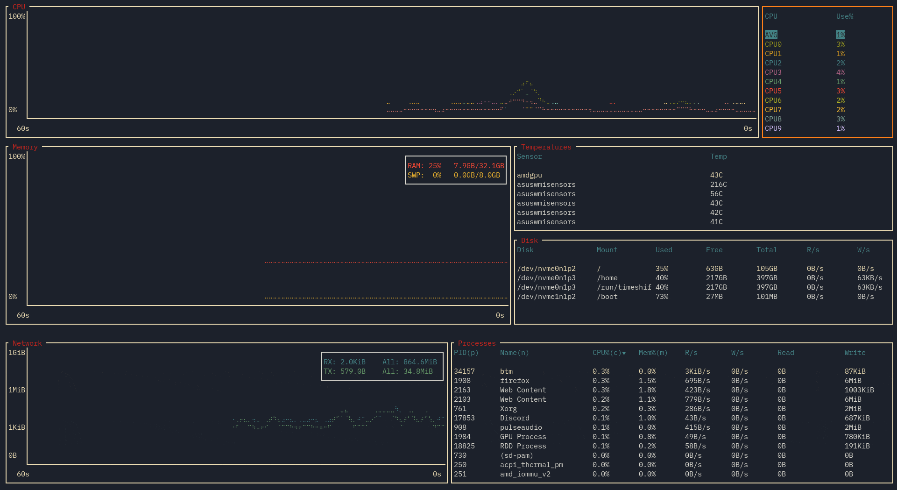
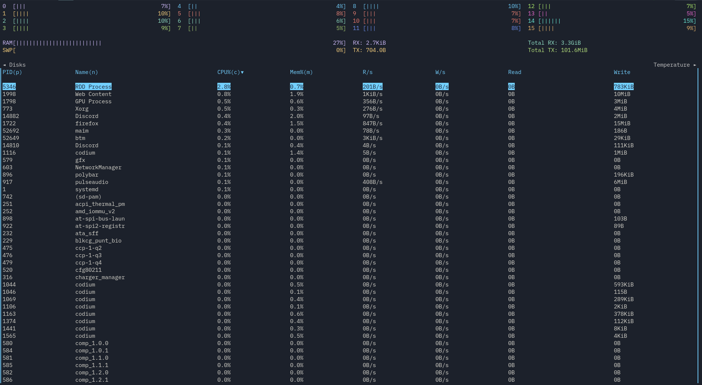
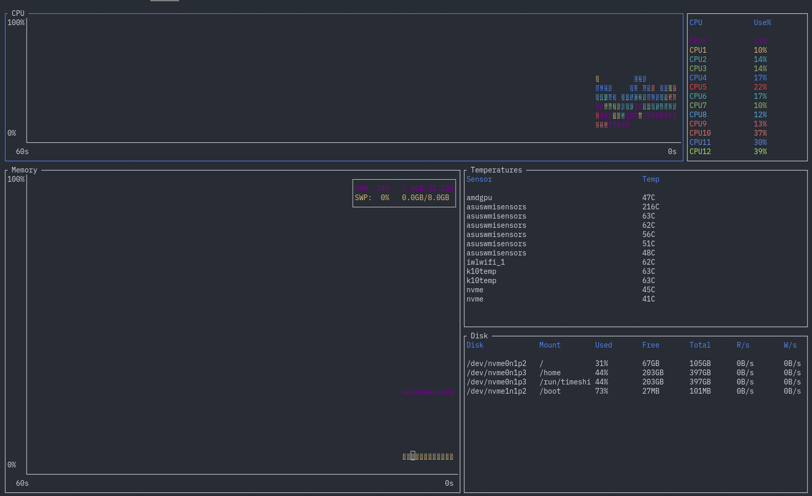
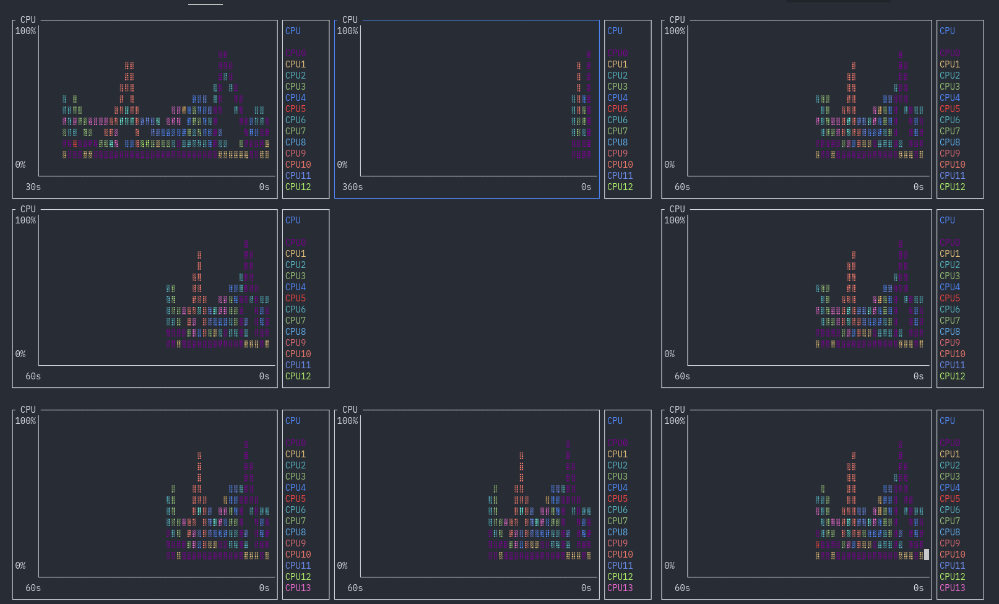
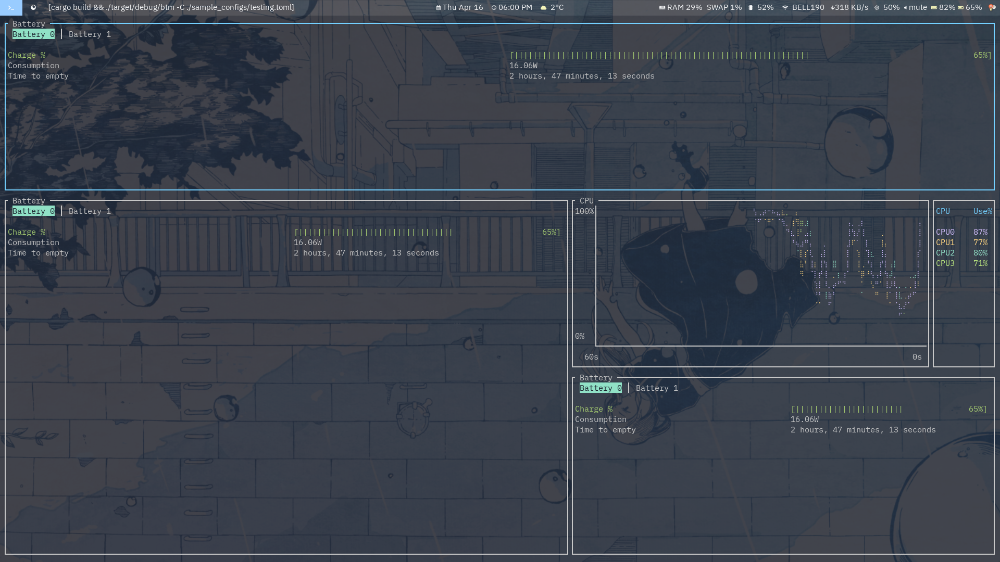

# bottom

[](https://travis-ci.com/ClementTsang/bottom)
[](https://crates.io/crates/bottom)
[](https://github.com/ClementTsang/bottom)
[](#contributors-)

A cross-platform graphical process/system monitor with a customizable interface and a multitude of features. Supports Linux, macOS, and Windows. Inspired by both [gtop](https://github.com/aksakalli/gtop) and [gotop](https://github.com/cjbassi/gotop).

<!--TODO: Update recording for 0.4-->

 _Theme based on [gruvbox](https://github.com/morhetz/gruvbox) (see [sample config](./sample_configs/demo_config.toml))._ Recorded on version 0.2.0.

**Note**: This documentation is relevant to version 0.4.0 and may refer to in-development or unreleased features, especially if you are reading this on the master branch. Please refer to [release branch](https://github.com/ClementTsang/bottom/tree/release/README.md) or [crates.io](https://crates.io/crates/bottom) for the most up-to-date _release_ documentation.

## Table of Contents

- [Installation](#installation)
  - [Manual](#manual)
  - [Cargo](#cargo)
  - [AUR](#aur)
  - [Debian (and Debian-based)](#debian)
  - [Homebrew](#homebrew)
  - [Scoop](#scoop)
  - [Chocolatey](#chocolatey)
- [Usage](#usage)
  - [Flags](#flags)
  - [Options](#options)
- [Keybindings](#keybindings)
  - [General](#general)
  - [CPU bindings](#cpu-bindings)
  - [Process bindings](#process-bindings)
  - [Process search bindings](#process-search-bindings)
  - [Battery bindings](#battery-bindings)
- [Features](#features)
  - [Process filtering](#process-filtering)
  - [Zoom](#zoom)
  - [Maximizing](#maximizing)
  - [Basic mode](#basic-mode)
  - [Config files](#config-files)
    - [Config flags](#config-flags)
    - [Theming](#theming)
    - [Layout](#layout)
  - [Battery](#battery)
  - [Compatibility](#compatibility)
- [Contribution](#contribution)
- [Bug reports and feature requests](#bug-reports-and-feature-requests)
- [Thanks](#thanks)

## Installation

Note that binaries are built on the stable version of Rust, and I mainly test and release for 64-bit. As such, support beyond these is not guaranteed.

### Manual

There are a few ways to go about doing this. For example:

```bash
# Clone and install the newest master version all via Cargo
cargo install --git https://github.com/ClementTsang/bottom

# Clone from master and install manually
git clone https://github.com/ClementTsang/bottom
cd bottom
cargo install --path .

# Download from releases and install
curl -LO https://github.com/ClementTsang/bottom/releases/download/0.3.0/bottom_source_code.tar.gz
tar -xzvf bottom_source_code.tar.gz
cargo install --path .
```

### Cargo

```bash
cargo install bottom
```

### AUR

```bash
yay bottom

# If you instead want a pre-built binary:
yay bottom-bin
```

### Debian

A `.deb` file is provided on each [release](https://github.com/ClementTsang/bottom/releases/latest):

```bash
curl -LO https://github.com/ClementTsang/bottom/releases/download/0.3.0/bottom_0.3.0_amd64.deb
sudo dpkg -i bottom_0.3.0_amd64.deb
```

### Homebrew

```bash
brew tap clementtsang/bottom
brew install bottom

# If you need to be more specific, use:
brew install clementtsang/bottom/bottom
```

### Scoop

```bash
scoop install bottom
```

### Chocolatey

Choco package located [here](https://chocolatey.org/packages/bottom).

```bash
choco install bottom

# Version number may be required for newer releases:
choco install bottom --version=0.3.0
```

## Usage

Run using `btm`.

### Flags

```
-h, --help                          Prints help information, including flags and options
-a, --avg_cpu                       Shows the average CPU usage in addition to per-core
-m, --dot-marker                    Uses a dot marker instead of the default braille marker
-c, --celsius                       Displays the temperature type in Celsius [default]
-f, --fahrenheit                    Displays the temperature type in Fahrenheit
-k, --kelvin                        Displays the temperature type in Kelvin
-l, --left_legend                   Displays the CPU legend to the left rather than the right
-u, --current_usage                 Sets process CPU usage to be based on current total CPU usage
-g, --group                         Groups together processes with the same name by default
-S, --case_sensitive                Search defaults to matching cases
-W, --whole                         Search defaults to searching for the whole word
-R, --regex                         Search defaults to using regex
-s, --show_disabled_data            Shows disabled CPU entries in the CPU legend
-b, --basic                         Enables basic mode, removing charts and condensing data
    --autohide_time                 Automatically hide the time scaling in graphs after being shown for a brief moment when
                                    zoomed in/out.  If time is disabled via --hide_time then this will have no effect
    --use_old_network_legend        Use the older (pre-0.4) network legend which is separate from the network chart
    --hide_table_gap                Hides the spacing between table headers and data
    --battery                       Displays the battery widget for default and basic layouts
```

### Options

```
-r, --rate <MS>                     Set the refresh rate in milliseconds [default: 1000]
-C, --config <PATH>                 Use the specified config file; if it does not exist it is automatically created [default: see section on config files]
-t, --default_time_value <MS>       Sets the default time interval for charts in milliseconds [default: 60000]
-d, --time_delta <MS>               Sets the default amount each zoom in/out action changes by in milliseconds [default: 15000]
    --default_widget_count <COUNT>  Which number of the selected widget type to select, from left to right, top to bottom [default: 1]
    --default_widget_type <TYPE>    The default widget type to select by default [default: "process"]
```

### Keybindings

#### General

|                                                    |                                                                                                |
| -------------------------------------------------- | ---------------------------------------------------------------------------------------------- |
| `q`, `Ctrl-c`                                      | Quit                                                                                           |
| `Esc`                                              | Close dialog windows, search, widgets, or exit maximized mode                                  |
| `Ctrl-r`                                           | Reset display and any collected data                                                           |
| `f`                                                | Freeze/unfreeze updating with new data                                                         |
| `Ctrl`-arrow key<br>`Shift`-arrow key<br>`H/J/K/L` | Move to a different widget (on macOS some keybindings may conflict)                            |
| `Up`,`k`                                           | Scroll up                                                                                      |
| `Down`, `j`                                        | Scroll down                                                                                    |
| `?`                                                | Open help menu                                                                                 |
| `gg`, `Home`                                       | Jump to the first entry                                                                        |
| `Shift-g`, `End`                                   | Jump to the last entry                                                                         |
| `Enter`                                            | Maximize the currently selected widget                                                         |
| `+`                                                | Zoom in on chart (decrease time range)                                                         |
| `-`                                                | Zoom out on chart (increase time range)                                                        |
| `=`                                                | Reset zoom                                                                                     |
| Mouse scroll                                       | Table: Scrolls through the list<br>Chart: Zooms in or out by scrolling up or down respectively |

#### CPU bindings

|         |                                              |
| ------- | -------------------------------------------- |
| `/`     | Open filtering for showing certain CPU cores |
| `Space` | Toggle enabled/disabled cores                |
| `Esc`   | Exit filtering mode                          |

#### Process bindings

|               |                                                            |
| ------------- | ---------------------------------------------------------- |
| `dd`          | Kill the selected process                                  |
| `c`           | Sort by CPU usage, press again to reverse sorting order    |
| `m`           | Sort by memory usage, press again to reverse sorting order |
| `p`           | Sort by PID name, press again to reverse sorting order     |
| `n`           | Sort by process name, press again to reverse sorting order |
| `Tab`         | Group/un-group processes with the same name                |
| `Ctrl-f`, `/` | Open process search widget                                 |

#### Process search bindings

|              |                                              |
| ------------ | -------------------------------------------- |
| `Tab`        | Toggle between searching by PID or name      |
| `Esc`        | Close the search widget (retains the filter) |
| `Ctrl-a`     | Skip to the start of the search query        |
| `Ctrl-e`     | Skip to the end of the search query          |
| `Ctrl-u`     | Clear the current search query               |
| `Backspace`  | Delete the character behind the cursor       |
| `Delete`     | Delete the character at the cursor           |
| `Alt-c`/`F1` | Toggle matching case                         |
| `Alt-w`/`F2` | Toggle matching the entire word              |
| `Alt-r`/`F3` | Toggle using regex                           |
| `Left`       | Move cursor left                             |
| `Right`      | Move cursor right                            |

#### Battery bindings

|         |                            |
| ------- | -------------------------- |
| `Left`  | Go to the next battery     |
| `Right` | Go to the previous battery |

## Features

As yet _another_ process/system visualization and management application, bottom supports the typical features:

- CPU, memory, and network usage visualization

- Display information about disk capacity and I/O per second

- Display temperatures from sensors

- Display information regarding processes, like CPU, memory, and I/O usage

- Process management (process killing _is_ all you need, right?)

It also aims to be:

- Lightweight

- Cross-platform - supports Linux, Windows, and macOS

In addition, bottom also currently has the following features:

### Process filtering

On any process widget, hit `/` to bring up a search bar. If the layout has
multiple process widgets, note this search is independent of other widgets. Searching
supports regex, matching case, and matching entire words. Use `Tab` to toggle between
searching by PID and by process name.

### Zoom

Using the `+`/`-` keys or the scroll wheel will move the current time intervals of the currently selected widget, and `=` to reset the zoom levels to the default.
Widgets can hold different time intervals independently. These time intervals can be adjusted using the
`-t`/`--default_time_value` and `-d`/`--time_delta` options, or their corresponding config options.

### Maximizing

Only care about one specific widget? You can go to that widget and hit `Enter` to make that widget take
up the entire drawing area.

### Basic mode

Using the `-b` or `--basic_mode` (or their corresponding config options) will open bottom in basic mode.
There are no charts or expanded mode when using this, and tables are condensed such that only one table is displayed
at a time.



Note custom layouts are currently not available when this is used.

### Config files

bottom supports reading from a config file to customize its behaviour and look. By default, bottom will look at `~/.config/bottom/bottom.toml` or `C:\Users\<USER>\AppData\Roaming\bottom\bottom.toml` on Unix and Windows systems respectively.

Note that if a config file does not exist at either the default location or the passed in location via `-C` or `--config`, one is automatically created with no settings applied.

#### Config flags

The following options can be set under `[flags]` to achieve the same effect as passing in a flag on runtime. Note that if a flag is given, it will override the config file.

These are the following supported flag config values:
| Field | Type |
|------------------------|---------------------------------------------------------------------------------------|
| `avg_cpu` | Boolean |
| `dot_marker` | Boolean |
| `left_legend` | Boolean |
| `current_usage` | Boolean |
| `group_processes` | Boolean |
| `case_sensitive` | Boolean |
| `whole_word` | Boolean |
| `regex` | Boolean |
| `show_disabled_data` | Boolean |
| `basic` | Boolean |
| `hide_table_count`| Boolean |
| `use_old_network_legend`| Boolean |
| `rate` | Unsigned Int (represents milliseconds) |
| `default_time_value` | Unsigned Int (represents milliseconds) |
| `time_delta` | Unsigned Int (represents milliseconds) |
| `temperature_type` | String (one of ["k", "f", "c", "kelvin", "fahrenheit", "celsius"]) |
| `default_widget_type` | String (one of ["cpu", "proc", "net", "temp", "mem", "disk"], same as layout options) |
| `default_widget_count` | Unsigned Int (represents which `default_widget_type`) |

#### Theming

The config file can be used to set custom colours for parts of the application under the `[colors]` object. The following labels are customizable with strings that are hex colours, RGB colours, or specific named colours.

Supported named colours are one of the following strings: `Reset, Black, Red, Green, Yellow, Blue, Magenta, Cyan, Gray, DarkGray, LightRed, LightGreen, LightYellow, LightBlue, LightMagenta, LightCyan, White`.

| Labels                          | Details                                               | Example                                                 |
| ------------------------------- | ----------------------------------------------------- | ------------------------------------------------------- |
| Table header colours            | Colour of table headers                               | `table_header_color="255, 255, 255"`                    |
| CPU colour per core             | Colour of each core. Read in order.                   | `cpu_core_colors=["#ffffff", "white", "255, 255, 255"]` |
| Average CPU colour              | The average CPU color                                 | `avg_cpu_color="White"`                                 |
| RAM                             | The colour RAM will use                               | `ram_color="#ffffff"`                                   |
| SWAP                            | The colour SWAP will use                              | `swap_color="#ffffff"`                                  |
| RX                              | The colour rx will use                                | `rx_color="#ffffff"`                                    |
| TX                              | The colour tx will use                                | `tx_color="#ffffff"`                                    |
| Widget title colour             | The colour of the label each widget has               | `widget_title_color="#ffffff"`                          |
| Border colour                   | The colour of the border of unselected widgets        | `border_color="#ffffff"`                                |
| Selected border colour          | The colour of the border of selected widgets          | `highlighted_border_color="#ffffff"`                    |
| Text colour                     | The colour of most text                               | `text_color="#ffffff"`                                  |
| Graph colour                    | The colour of the lines and text of the graph         | `graph_color="#ffffff"`                                 |
| Cursor colour                   | The cursor's colour                                   | `cursor_color="#ffffff"`                                |
| Selected text colour            | The colour of text that is selected                   | `scroll_entry_text_color="#ffffff"`                     |
| Selected text background colour | The background colour of text that is selected        | `scroll_entry_bg_color="#ffffff"`                       |
| Battery bar colours             | Colour used is based on percentage and no. of colours | `battery_colours=["green", "yellow", "red"]`            |

#### Layout

bottom supports customizable layouts via the config file. Currently, layouts are controlled by using TOML objects and arrays.

For example, given the sample layout:

```toml
[[row]]
  [[row.child]]
  type="cpu"
[[row]]
    ratio=2
    [[row.child]]
      ratio=4
      type="mem"
    [[row.child]]
      ratio=3
      [[row.child.child]]
        type="temp"
      [[row.child.child]]
        type="disk"
```

This would give a layout that has two rows, with a 1:2 ratio. The first row has only the CPU widget.
The second row is split into two columns with a 4:3 ratio. The first column contains the memory widget.
The second column is split into two rows with a 1:1 ratio. The first is the temperature widget, the second is the disk widget.

This is what the layout would look like when run:



Each `[[row]]` represents a _row_ in the layout. A row can have any number of `child` values. Each `[[row.child]]`
represents either a _column or a widget_. A column can have any number of `child` values as well. Each `[[row.child.child]]`
represents a _widget_. A widget is represented by having a `type` field set to a string.

The following `type` values are supported:
| | |
|---------|--------------------------|
| `"cpu"` | CPU chart and legend |
| `"mem", "memory"` | Memory chart |
| `"net", "network"` | Network chart and legend |
| `"proc", "process", "processes"` | Process table and search |
| `"temp", "temperature"` | Temperature table |
| `"disk"` | Disk table |
| `"empty"` | An empty space |
| `"batt", "battery"` | Battery statistics |

Each component of the layout accepts a `ratio` value. If this is not set, it defaults to 1.

For an example, look at the [default config](./sample_configs/default_config.toml), which contains the default layout.

...and yes, you can have duplicate widgets. This means you could do something like:

```toml
[[row]]
  ratio=1
  [[row.child]]
  type="cpu"
  [[row.child]]
  type="cpu"
  [[row.child]]
  type="cpu"
[[row]]
  ratio=1
  [[row.child]]
  type="cpu"
  [[row.child]]
  type="empty"
  [[row.child]]
  type="cpu"
[[row]]
  ratio=1
  [[row.child]]
  type="cpu"
  [[row.child]]
  type="cpu"
  [[row.child]]
  type="cpu"
```

and get the following CPU donut:


### Battery

You can get battery statistics (charge, time to fill/discharge, consumption in watts, and battery health) via the battery widget.

Since this is only useful for devices like laptops, it is off by default. You can either enable the widget in the default layout via the `--battery` flag, or by specifying the widget in a [layout](#layout).

So with this slightly silly layout:

```toml
[[row]]
  ratio=1
  [[row.child]]
  type="batt"
[[row]]
    ratio=2
    [[row.child]]
      ratio=4
      type="batt"
    [[row.child]]
      ratio=3
      [[row.child.child]]
        type="cpu"
      [[row.child.child]]
        type="batt"
```

You get this:



### Compatibility

The current compatibility of widgets with operating systems from personal testing:

| OS      | CPU | Memory | Disks | Temperature | Processes/Search | Networks | Battery                                      |
| ------- | --- | ------ | ----- | ----------- | ---------------- | -------- | -------------------------------------------- |
| Linux   | ✓   | ✓      | ✓     | ✓           | ✓                | ✓        | ✓                                            |
| Windows | ✓   | ✓      | ✓     | ✗           | ✓                | ✓        | ✓ (seems to have issues with dual batteries) |
| macOS   | ✓   | ✓      | ✓     | ✓           | ✓                | ✓        | ✓                                            |

## Contribution

Contribution is always welcome - just submit a PR! Note that I currently develop and test on stable Rust.

Thanks to all contributors ([emoji key](https://allcontributors.org/docs/en/emoji-key)):

<!-- ALL-CONTRIBUTORS-LIST:START - Do not remove or modify this section -->
<!-- prettier-ignore-start -->
<!-- markdownlint-disable -->
<table>
  <tr>
    <td align="center"><a href="http://shilangyu.github.io"><br /><sub><b>Marcin Wojnarowski</b></sub></a><br /><a href="https://github.com/ClementTsang/bottom/commits?author=shilangyu" title="Code">💻</a> <a href="#platform-shilangyu" title="Packaging/porting to new platform">📦</a></td>
    <td align="center"><a href="http://neosmart.net/"><br /><sub><b>Mahmoud Al-Qudsi</b></sub></a><br /><a href="https://github.com/ClementTsang/bottom/commits?author=mqudsi" title="Code">💻</a></td>
  </tr>
</table>

<!-- markdownlint-enable -->
<!-- prettier-ignore-end -->

<!-- ALL-CONTRIBUTORS-LIST:END -->

## Bug reports and feature requests

Feel free to submit feature ideas and bug reports on [GitHub](https://github.com/ClementTsang/bottom/issues).
Please try to follow the given issue templates.

## Thanks

- This project is very much inspired by both
  [gotop](https://github.com/cjbassi/gotop) and [gtop](https://github.com/aksakalli/gtop).

- Basic mode is heavily inspired by [htop's](https://hisham.hm/htop/) design.

- This application was written with many, _many_ libraries, and built on the
  work of many talented people. This application would be impossible
  without their work.
