# bottom


[](https://crates.io/crates/bottom)

A cross-platform graphical process/system monitor with a customizable interface and a multitude of features. Supports Linux, macOS, and Windows. Inspired by [gtop](https://github.com/aksakalli/gtop), [gotop](https://github.com/xxxserxxx/gotop), and [htop](https://github.com/htop-dev/htop/).

 _Theme based on [gruvbox](https://github.com/morhetz/gruvbox)_ (`--color gruvbox`). _Font is [IBM Plex Mono](https://www.ibm.com/plex/), terminal is [Kitty](https://sw.kovidgoyal.net/kitty/)._

**Note**: If you are reading this on the master branch, then it may refer to in-development or un-released features/changes. Please refer to [release branch](https://github.com/ClementTsang/bottom/tree/release/README.md) or [crates.io](https://crates.io/crates/bottom) for the most up-to-date _release_ documentation.

## Table of Contents

- [Support](#support)
  - [Compatibility](#compatibility)
  - [Other known platform-specific issues](#other-known-platform-specific-issues)
- [Installation](#installation)
  - [Manually](#manually)
  - [Nightly](#nightly)
  - [Cargo](#cargo)
  - [AUR](#aur)
  - [Debian](#debian)
  - [Fedora/CentOS](#fedoracentos)
  - [Gentoo](#gentoo)
  - [Nix](#nix)
  - [Solus](#solus)
  - [MacPorts](#macports)
  - [Homebrew](#homebrew)
  - [Scoop](#scoop)
  - [Chocolatey](#chocolatey)
  - [winget](#winget)
  - [Auto-completion](#auto-completion)
- [Usage](#usage)
  - [Flags](#flags)
  - [Keybindings](#keybindings)
    - [General](#general)
    - [Process bindings](#process-bindings)
    - [Process search bindings](#process-search-bindings)
  - [Process sort bindings](#process-sort-bindings)
    - [Battery bindings](#battery-bindings)
    - [Basic memory bindings](#basic-memory-bindings)
  - [Process searching keywords](#process-searching-keywords)
    - [Supported search types](#supported-search-types)
    - [Supported comparison operators](#supported-comparison-operators)
    - [Supported logical operators](#supported-logical-operators)
    - [Supported units](#supported-units)
    - [Other syntax](#other-syntax)
  - [Mousebindings](#mousebindings)
    - [General](#general-1)
    - [CPU bindings](#cpu-bindings)
    - [Process bindings](#process-bindings-1)
- [Features](#features)
  - [Processes](#processes)
    - [Process searching](#process-searching)
    - [Process sorting](#process-sorting)
    - [Tree mode](#tree-mode)
  - [Zoom](#zoom)
  - [Expand](#expand)
  - [Basic mode](#basic-mode)
  - [Config files](#config-files)
    - [Config flags](#config-flags)
    - [Theming](#theming)
    - [Layout](#layout)
    - [Disk, temperature, and network filtering](#disk-temperature-and-network-filtering)
  - [Battery](#battery)
- [FAQ](#faq)
- [Contribution](#contribution)
  - [Contributors](#contributors)
- [Thanks](#thanks)

## Support

Note that bottom is:

- Built and released using the most recent stable version of Rust
- Officially supports:
  - macOS (`x86_64`)
  - Linux (`x86_64`, `i686`, `aarch64`)
  - Windows (`x86_64`, `i686`)

Operating systems, versions of Rust, or platforms that are outside of this list are
_not_ currently officially supported - even if it is built, tested, or works - and I may not be
able to fix bugs for these!

### Compatibility

The current compatibility of widgets with operating systems from personal testing:

| OS      | CPU | Memory | Disks | Temperature                          | Processes/Search                           | Networks | Battery                                      |
| ------- | --- | ------ | ----- | ------------------------------------ | ------------------------------------------ | -------- | -------------------------------------------- |
| Linux   | ✓   | ✓      | ✓     | ✓                                    | ✓                                          | ✓        | ✓                                            |
| Windows | ✓   | ✓      | ✓     | ? (seems to require elevated access) | ✓                                          | ✓        | ✓ (seems to have issues with dual batteries) |
| macOS   | ✓   | ✓      | ✓     | ✓                                    | ✓ (requires `sudo btm` to show everything) | ✓        | ✓                                            |

### Other known platform-specific issues

- M1-based macOS devices may have issues with temperature sensors not returning anything.

- For now, WSL has an issue reporting total memory usage.

- WSL and WSL2 (as far as I know) cannot correctly report temperature sensors.

- WSL2 will not match Windows' own Task Manager, this appears to be due to how WSL2 works.

## Installation

### Manually

There are a few ways to go about doing this manually. If you do so, please build using the current stable release of Rust. For example:

```bash
# If required, update Rust on the stable channel
rustup update stable

# Clone and install the newest master version all via Cargo
cargo install --git https://github.com/ClementTsang/bottom

# Clone from master and install manually
git clone https://github.com/ClementTsang/bottom
cd bottom
cargo install --path .

# Download from releases and install
curl -LO https://github.com/ClementTsang/bottom/archive/0.6.1.tar.gz
tar -xzvf 0.6.1.tar.gz
cargo install --path .
```

Or, you can just download the binary from the [latest release](https://github.com/ClementTsang/bottom/releases/latest).

### Nightly

You can install pre-release nightly versions [here](https://github.com/ClementTsang/bottom/releases/tag/nightly). Builds are generated every day at 00:00 UTC, based on the most recent commit on the master branch.

### Cargo

```bash
# If required, update Rust on the stable channel
rustup update stable

cargo install bottom

# OR, --locked may be required due to how cargo install works
cargo install bottom --locked
```

### AUR

Normal package found [here](https://aur.archlinux.org/packages/bottom/), binary package found [here](https://aur.archlinux.org/packages/bottom-bin/):

```bash
yay -S bottom

# If you instead want a pre-built binary:
yay -S bottom-bin
```

### Debian

A `.deb` file is provided on each [release](https://github.com/ClementTsang/bottom/releases/latest):

```bash
curl -LO https://github.com/ClementTsang/bottom/releases/download/0.6.1/bottom_0.6.1_amd64.deb
sudo dpkg -i bottom_0.6.1_amd64.deb
```

### Fedora/CentOS

Available in [COPR](https://copr.fedorainfracloud.org/coprs/atim/bottom/):

```bash
sudo dnf copr enable atim/bottom -y
sudo dnf install bottom
```

### Gentoo

Available in [GURU](https://wiki.gentoo.org/wiki/Project:GURU) and [dm9pZCAq](https://github.com/gentoo-mirror/dm9pZCAq) overlays

```bash
sudo eselect repository enable guru
sudo emerge --sync guru
echo "sys-process/bottom" | sudo tee /etc/portage/package.accept_keywords/10-guru
sudo emerge sys-process/bottom::guru
```

or

```bash
sudo eselect repository enable dm9pZCAq
sudo emerge --sync dm9pZCAq
sudo emerge sys-process/bottom::dm9pZCAq
```

### Nix

```bash
nix-env -i bottom
```

### Solus

```
sudo eopkg it bottom
```

### Homebrew

```bash
brew tap clementtsang/bottom
brew install bottom

# If you need to be more specific, use:
brew install clementtsang/bottom/bottom
```

### MacPorts

```bash
sudo port selfupdate
sudo port install bottom
```

### Scoop

```bash
scoop install bottom
```

### Chocolatey

Choco package located [here](https://chocolatey.org/packages/bottom).
Since validation of the package takes time, it may take a while to become available after a release.

```bash
choco install bottom

# Version number may be required for newer releases, if available:
choco install bottom --version=0.6.1
```

### winget

You can find the packages [here](https://github.com/microsoft/winget-pkgs/tree/master/manifests/Clement/bottom).
Since validation of the package takes time, it may take a while to become available after a release.

```bash
winget install bottom
```

You can also manually do the same thing by going to the [latest release](https://github.com/ClementTsang/bottom/releases/latest)
and installing via the `.msi` file.

You can uninstall via Control Panel or Options in Windows.

### Auto-completion

Shell completions are included in binary releases, and are generated in the same directory as the
binary if bottom is manually built.

- For bash, move `btm.bash` to `$XDG_CONFIG_HOME/bash_completion or /etc/bash_completion.d/`.
- For fish, move `btm.fish` to `$HOME/.config/fish/completions/`.
- For zsh, move `_btm` to one of your `$fpath` directories.
- For PowerShell, add `. _btm.ps1` to your PowerShell
  [profile](<https://docs.microsoft.com/en-us/previous-versions//bb613488(v=vs.85)>).

Some install scripts (i.e. AUR) will automatically do this for you.

## Usage

Run using `btm`.

### Flags

Use `btm --help` for more information.

```
        --autohide_time                        Temporarily shows the time scale in graphs.
    -b, --basic                                Hides graphs and uses a more basic look.
        --battery                              Shows the battery widget.
    -S, --case_sensitive                       Enables case sensitivity by default.
    -c, --celsius                              Sets the temperature type to Celsius.
        --color <COLOR SCHEME>                 Use a color scheme, use --help for supported values.
    -C, --config <CONFIG PATH>                 Sets the location of the config file.
    -u, --current_usage                        Sets process CPU% to be based on current CPU%.
    -t, --default_time_value <MS>              Default time value for graphs in ms.
        --default_widget_count <INT>           Sets the n'th selected widget type as the default.
        --default_widget_type <WIDGET TYPE>    Sets the default widget type, use --help for more info.
        --disable_advanced_kill                Hides advanced options to stop a process on Unix-like systems.
        --disable_click                        Disables mouse clicks.
    -m, --dot_marker                           Uses a dot marker for graphs.
    -f, --fahrenheit                           Sets the temperature type to Fahrenheit.
    -g, --group                                Groups processes with the same name by default.
    -h, --help                                 Prints help information.  Use --help for more info.
    -a, --hide_avg_cpu                         Hides the average CPU usage.
        --hide_table_gap                       Hides the spacing between table headers and entries.
        --hide_time                            Completely hides the time scaling.
    -k, --kelvin                               Sets the temperature type to Kelvin.
    -l, --left_legend                          Puts the CPU chart legend to the left side.
        --mem_as_value                         Defaults to showing process memory usage by value.
        --network_use_binary_prefix            Displays the network widget with binary prefixes.
        --network_use_bytes                    Displays the network widget using bytes.
        --network_use_log                      Displays the network widget with a log scale.
        --process_command                      Show processes as their commands by default.
    -r, --rate <MS>                            Sets a refresh rate in ms.
    -R, --regex                                Enables regex by default.
        --show_table_scroll_position           Shows the scroll position tracker in table widgets.
    -d, --time_delta <MS>                      The amount in ms changed upon zooming.
    -T, --tree                                 Defaults to showing the process widget in tree mode.
        --use_old_network_legend               DEPRECATED - uses the older network legend.
    -V, --version                              Prints version information.
    -W, --whole_word                           Enables whole-word matching by default.
```

### Keybindings

#### General

|                                             |                                                              |
| ------------------------------------------- | ------------------------------------------------------------ |
| `q`, `Ctrl-c`                               | Quit                                                         |
| `Esc`                                       | Close dialog windows, search, widgets, or exit expanded mode |
| `Ctrl-r`                                    | Reset display and any collected data                         |
| `f`                                         | Freeze/unfreeze updating with new data                       |
| `Ctrl-Left`<br>`Shift-Left`<br>`H`<br>`A`   | Move widget selection left                                   |
| `Ctrl-Right`<br>`Shift-Right`<br>`L`<br>`D` | Move widget selection right                                  |
| `Ctrl-Up`<br>`Shift-Up`<br>`K`<br>`W`       | Move widget selection up                                     |
| `Ctrl-Down`<br>`Shift-Down`<br>`J`<br>`S`   | Move widget selection down                                   |
| `Left`, `h`                                 | Move left within widget                                      |
| `Down`, `j`                                 | Move down within widget                                      |
| `Up`,`k`                                    | Move up within widget                                        |
| `Right`, `l`                                | Move right within widget                                     |
| `?`                                         | Open help menu                                               |
| `gg`, `Home`                                | Jump to the first entry                                      |
| `Shift-g`, `End`                            | Jump to the last entry                                       |
| `e`                                         | Toggle expanding the currently selected widget               |
| `+`                                         | Zoom in on chart (decrease time range)                       |
| `-`                                         | Zoom out on chart (increase time range)                      |
| `=`                                         | Reset zoom                                                   |

#### Process bindings

|               |                                                                  |
| ------------- | ---------------------------------------------------------------- |
| `dd`          | Kill the selected process                                        |
| `c`           | Sort by CPU usage, press again to reverse sorting order          |
| `m`           | Sort by memory usage, press again to reverse sorting order       |
| `p`           | Sort by PID name, press again to reverse sorting order           |
| `n`           | Sort by process name, press again to reverse sorting order       |
| `Tab`         | Group/un-group processes with the same name                      |
| `Ctrl-f`, `/` | Open process search widget                                       |
| `P`           | Toggle between showing the full command or just the process name |
| `s, F6`       | Open process sort widget                                         |
| `I`           | Invert current sort                                              |
| `%`           | Toggle between values and percentages for memory usage           |
| `t`, `F5`     | Toggle tree mode                                                 |

#### Process search bindings

|               |                                              |
| ------------- | -------------------------------------------- |
| `Tab`         | Toggle between searching by PID or name      |
| `Esc`         | Close the search widget (retains the filter) |
| `Ctrl-a`      | Skip to the start of the search query        |
| `Ctrl-e`      | Skip to the end of the search query          |
| `Ctrl-u`      | Clear the current search query               |
| `Ctrl-w`      | Delete a word behind the cursor              |
| `Ctrl-h`      | Delete the character behind the cursor       |
| `Backspace`   | Delete the character behind the cursor       |
| `Delete`      | Delete the character at the cursor           |
| `Alt-c`, `F1` | Toggle matching case                         |
| `Alt-w`, `F2` | Toggle matching the entire word              |
| `Alt-r`, `F3` | Toggle using regex                           |
| `Left`        | Move cursor left                             |
| `Right`       | Move cursor right                            |

### Process sort bindings

|                |                                 |
| -------------- | ------------------------------- |
| `Down`, `j`    | Scroll down in list             |
| `Up`, `k`      | Scroll up in list               |
| `Mouse scroll` | Scroll through sort widget      |
| `Esc`          | Close the sort widget           |
| `Enter`        | Sort by current selected column |

#### Battery bindings

|                |                            |
| -------------- | -------------------------- |
| `Left, Alt-h`  | Go to the next battery     |
| `Right, Alt-l` | Go to the previous battery |

#### Basic memory bindings

|     |                                                        |
| --- | ------------------------------------------------------ |
| `%` | Toggle between values and percentages for memory usage |

### Process searching keywords

- None of the keywords are case sensitive.
- Use brackets to logically group together parts of the search.
- Furthermore, if you want to search a reserved keyword, surround the text in quotes - for example, `"or" or "(sd-pam)"` would be a valid search:

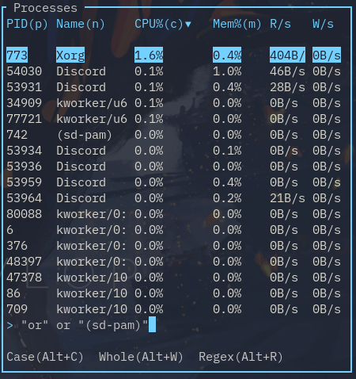

#### Supported search types

| Keywords            | Example            | Description                                                                     |
| ------------------- | ------------------ | ------------------------------------------------------------------------------- |
|                     | `btm`              | Matches by process or command name; supports regex                              |
| `pid`               | `pid=1044`         | Matches by PID; supports regex                                                  |
| `cpu`, `cpu%`       | `cpu > 0.5`        | Matches the CPU column; supports comparison operators                           |
| `memb`              | `memb > 1000 b`    | Matches the memory column in terms of bytes; supports comparison operators      |
| `mem`, `mem%`       | `mem < 0.5`        | Matches the memory column in terms of percent; supports comparison operators    |
| `read`, `r/s`       | `read = 1 mb`      | Matches the read/s column in terms of bytes; supports comparison operators      |
| `write`, `w/s`      | `write >= 1 kb`    | Matches the write/s column in terms of bytes; supports comparison operators     |
| `tread`, `t.read`   | `tread <= 1024 gb` | Matches he total read column in terms of bytes; supports comparison operators   |
| `twrite`, `t.write` | `twrite > 1024 tb` | Matches the total write column in terms of bytes; supports comparison operators |
| `user`              | `user=root`        | Matches by user; supports regex                                                 |
| `state`             | `state=running`    | Matches by state; supports regex                                                |

#### Supported comparison operators

| Keywords | Description                                                    |
| -------- | -------------------------------------------------------------- |
| `=`      | Checks if the values are equal                                 |
| `>`      | Checks if the left value is strictly greater than the right    |
| `<`      | Checks if the left value is strictly less than the right       |
| `>=`     | Checks if the left value is greater than or equal to the right |
| `<=`     | Checks if the left value is less than or equal to the right    |

#### Supported logical operators

Note that the `and` operator takes precedence over the `or` operator.

| Keywords           | Usage                                        | Description                                         |
| ------------------ | -------------------------------------------- | --------------------------------------------------- |
| `and, &&, <Space>` | `<CONDITION 1> and/&&/<Space> <CONDITION 2>` | Requires both conditions to be true to match        |
| `or, \|\|`         | `<CONDITION 1> or/\|\| <CONDITION 2>`        | Requires at least one condition to be true to match |

#### Supported units

| Keywords | Description |
| -------- | ----------- |
| `B`      | Bytes       |
| `KB`     | Kilobytes   |
| `MB`     | Megabytes   |
| `GB`     | Gigabytes   |
| `TB`     | Terabytes   |
| `KiB`    | Kibibytes   |
| `MiB`    | Mebibytes   |
| `GiB`    | Gibibytes   |
| `TiB`    | Tebibytes   |

#### Other syntax

| Keywords | Usage                                                | Description                |
| -------- | ---------------------------------------------------- | -------------------------- |
| `()`     | `(<CONDITION 1> AND <CONDITION 2>) OR <CONDITION 3>` | Group together a condition |

### Mousebindings

#### General

|        |                                                                                                       |
| ------ | ----------------------------------------------------------------------------------------------------- |
| Scroll | Table: Scroll<br>Chart: Zooms in or out by scrolling up or down respectively                          |
| Click  | Selects the clicked widget, table entry, dialog option, or tab.<br>Can be disabled via options/flags. |

#### CPU bindings

|        |                                                                       |
| ------ | --------------------------------------------------------------------- |
| Scroll | Scrolling over an CPU core/average shows only that entry on the chart |

#### Process bindings

|                        |                                                                                                     |
| ---------------------- | --------------------------------------------------------------------------------------------------- |
| Click on process entry | If in tree mode and you click on a selected entry, it toggles whether the branch is expanded or not |
| Click on table header  | Sorts the widget by that column, or inverts the sort if already selected                            |

## Features

As yet _another_ process/system visualization and management application, bottom supports the typical features:

- CPU usage visualization, on an average and per-core basis

- RAM and swap usage visualization

- Network visualization for receiving and transmitting

- Display information about disk capacity and I/O per second

- Display temperatures from sensors

- Display information regarding processes, like CPU, memory, I/O usage, user, and process state

- Process management (well, if process killing is all you need)

It also aims to be:

- Lightweight

- Cross-platform - supports 64-bit Linux, Windows, and macOS

In addition, bottom also currently has the following features:

### Processes

#### Process searching

On any process widget, hit `/` to bring up a search bar. If the layout has multiple process widgets, note this search is independent of other widgets.

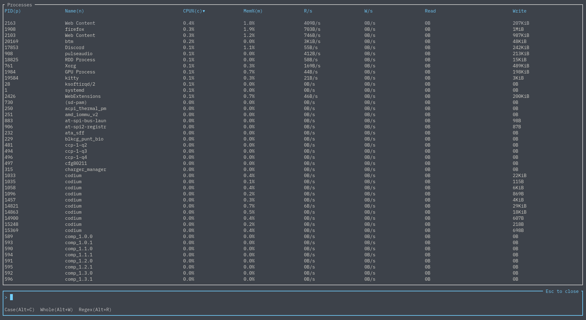

By default, just typing in something will search by process name:

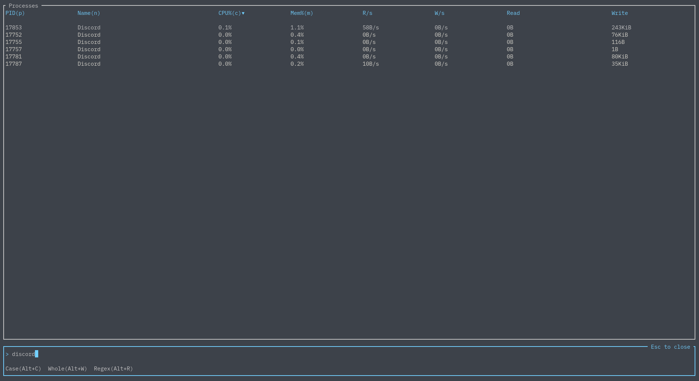

This simple search can be refined by matching by case, matching the entire word, or by using regex:

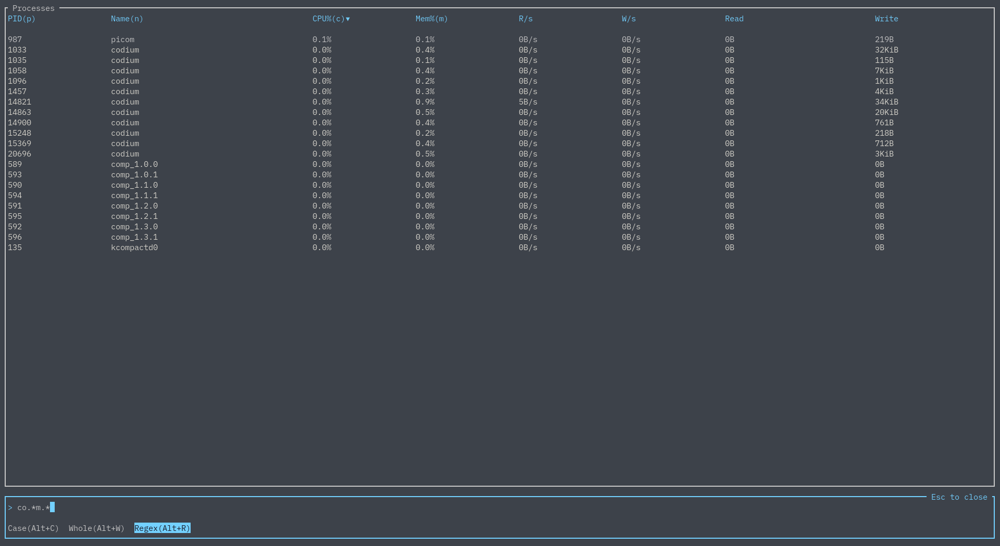

Now let's say you want to search for two things - luckily, we have the `AND` and `OR` logical operators:

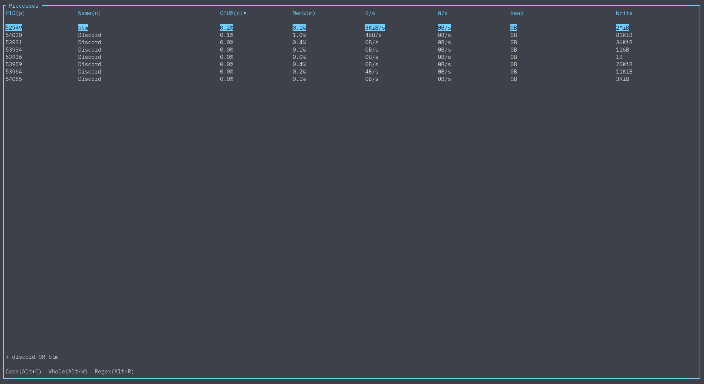

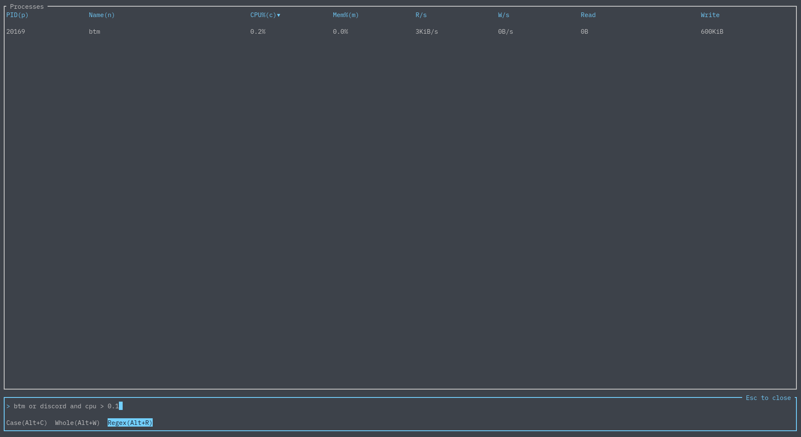

Furthermore, one is able to refine their searches by CPU usage, memory usage, PID, and more. For example:


You can see all available keywords and query options [here](#process-searching-keywords).

#### Process sorting

You can sort the processes list by any column you want by pressing `s` while on a process widget:

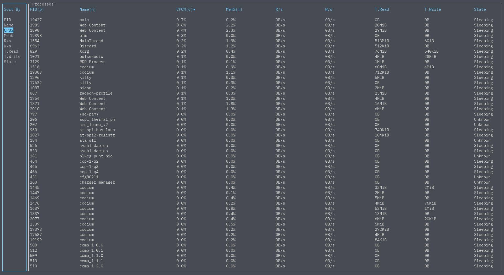

#### Tree mode

Use `t` or `F5` to toggle tree mode in a process widget. This is somewhat similar to htop's tree
mode.

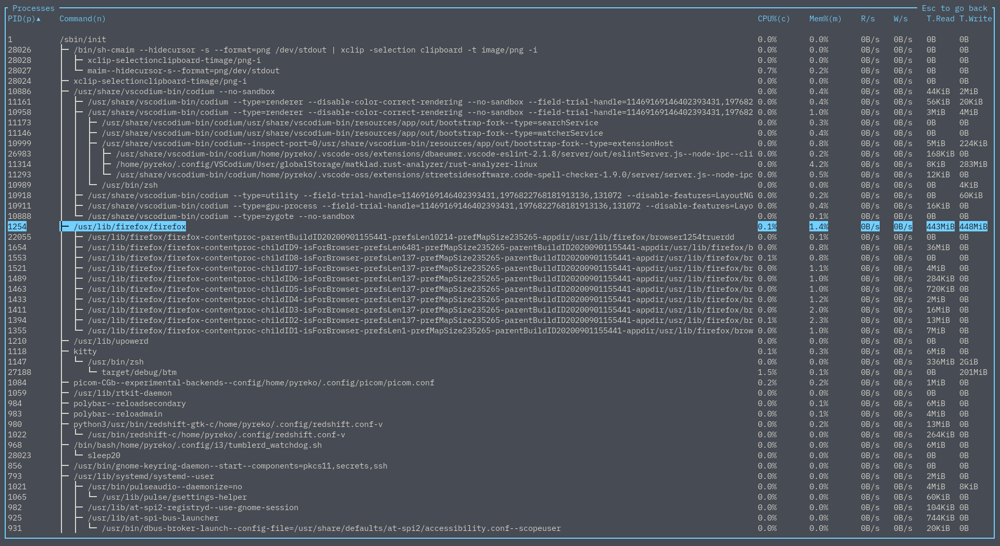

Sorting works as well, but it is done per groups of siblings. For example, by CPU%:

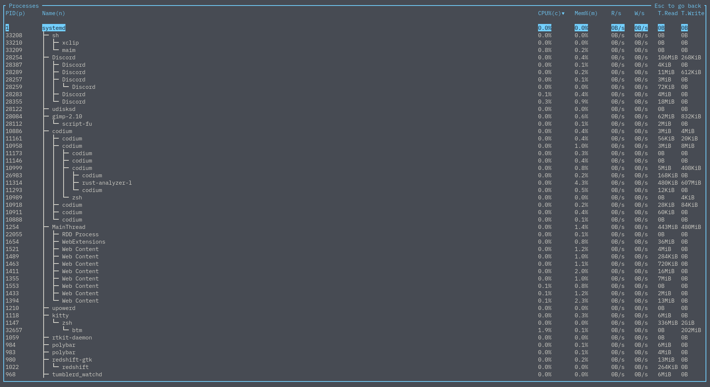

You can also still filter processes. Branches that entirely do not match the query are pruned out,
but if a branch contains an element that does match the query, any non-matching elements will instead
just be greyed out, so the tree structure is still maintained:

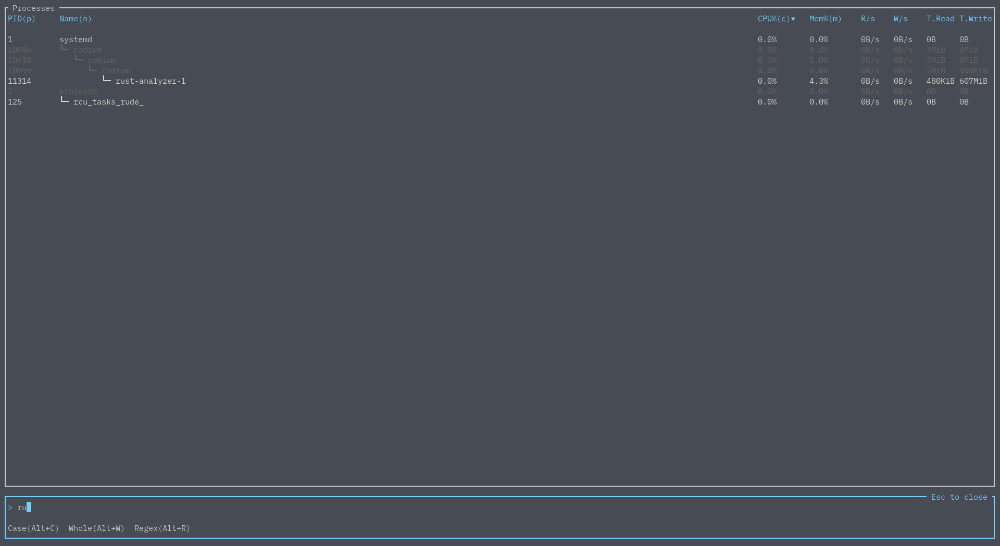

### Zoom

Using the `+`/`-` keys or the scroll wheel will move the current time intervals of the currently selected widget, and `=` to reset the zoom levels to the default.
Widgets can hold different time intervals independently. These time intervals can be adjusted using the
`-t`/`--default_time_value` and `-d`/`--time_delta` options, or their corresponding config options.

### Expand

Only care about one specific widget? You can go to that widget and hit `e` to make that widget expand and take
up the entire drawing area. You can minimize this expanded widget with `Esc` or pressing `e` again.

### Basic mode

Using the `-b` or `--basic_mode` (or their corresponding config options) will open bottom in basic mode.
There are no charts or expanded mode when using this, and tables are condensed such that only one table is displayed
at a time.


Note custom layouts are currently not available when this is used.

### Config files

bottom supports reading from a config file to customize its behaviour and look.
By default, bottom will look at (based on [dirs](https://github.com/dirs-dev/dirs-rs#features)):

| OS                                                                      | Location |
| ----------------------------------------------------------------------- | -------- |
| `~/.config/bottom/bottom.toml` or `$XDG_CONFIG_HOME/bottom/bottom.toml` | Linux/macOS    |
| `$HOME/Library/Application Support/bottom/bottom.toml`                  | macOS    |
| `C:\Users\<USER>\AppData\Roaming\bottom\bottom.toml`                    | Windows  |

Note that if a config file does not exist at either the default location or the passed in location via `-C` or `--config`, one is automatically created with no settings applied.

#### Config flags

The following options can be set under `[flags]` to achieve the same effect as passing in a flag on runtime. Note that if a flag is given, it will override the config file.

These are the following supported flag config values, which correspond to the flag of the same name described in [Flags](#flags):

| Field                        | Type                                                                                           | Functionality                                                  |
| ---------------------------- | ---------------------------------------------------------------------------------------------- | -------------------------------------------------------------- |
| `hide_avg_cpu`               | Boolean                                                                                        | Hides the average CPU usage.                                   |
| `dot_marker`                 | Boolean                                                                                        | Uses a dot marker for graphs.                                  |
| `left_legend`                | Boolean                                                                                        | Puts the CPU chart legend to the left side.                    |
| `current_usage`              | Boolean                                                                                        | Sets process CPU% to be based on current CPU%.                 |
| `group_processes`            | Boolean                                                                                        | Groups processes with the same name by default.                |
| `case_sensitive`             | Boolean                                                                                        | Enables case sensitivity by default.                           |
| `whole_word`                 | Boolean                                                                                        | Enables whole-word matching by default.                        |
| `regex`                      | Boolean                                                                                        | Enables regex by default.                                      |
| `basic`                      | Boolean                                                                                        | Hides graphs and uses a more basic look.                       |
| `use_old_network_legend`     | Boolean                                                                                        | DEPRECATED - uses the older network legend.                    |
| `battery`                    | Boolean                                                                                        | Shows the battery widget.                                      |
| `rate`                       | Unsigned Int (represents milliseconds)                                                         | Sets a refresh rate in ms.                                     |
| `default_time_value`         | Unsigned Int (represents milliseconds)                                                         | Default time value for graphs in ms.                           |
| `time_delta`                 | Unsigned Int (represents milliseconds)                                                         | The amount in ms changed upon zooming.                         |
| `temperature_type`           | String (one of ["k", "f", "c", "kelvin", "fahrenheit", "celsius"])                             | Sets the temperature unit type.                                |
| `default_widget_type`        | String (one of ["cpu", "proc", "net", "temp", "mem", "disk"], same as layout options)          | Sets the default widget type, use --help for more info.        |
| `default_widget_count`       | Unsigned Int (represents which `default_widget_type`)                                          | Sets the n'th selected widget type as the default.             |
| `disable_click`              | Boolean                                                                                        | Disables mouse clicks.                                         |
| `color`                      | String (one of ["default", "default-light", "gruvbox", "gruvbox-light", "nord", "nord-light"]) | Use a color scheme, use --help for supported values.           |
| `mem_as_value`               | Boolean                                                                                        | Defaults to showing process memory usage by value.             |
| `tree`                       | Boolean                                                                                        | Defaults to showing the process widget in tree mode.           |
| `show_table_scroll_position` | Boolean                                                                                        | Shows the scroll position tracker in table widgets.            |
| `process_command`            | Boolean                                                                                        | Show processes as their commands by default.                   |
| `disable_advanced_kill`      | Boolean                                                                                        | Hides advanced options to stop a process on Unix-like systems. |
| `network_use_binary_prefix`  | Boolean                                                                                        | Displays the network widget with binary prefixes.              |
| `network_use_bytes`          | Boolean                                                                                        | Displays the network widget using bytes.                       |
| `network_use_log`            | Boolean                                                                                        | Displays the network widget with a log scale.                  |

#### Theming

The config file can be used to set custom colours for parts of the application under the `[colors]` object. The following labels are customizable with strings that are hex colours, RGB colours, or specific named colours.

Supported named colours are one of the following strings: `Reset, Black, Red, Green, Yellow, Blue, Magenta, Cyan, Gray, DarkGray, LightRed, LightGreen, LightYellow, LightBlue, LightMagenta, LightCyan, White`.

| Labels                          | Details                                                 | Example                                                 |
| ------------------------------- | ------------------------------------------------------- | ------------------------------------------------------- |
| Table header colours            | Colour of table headers                                 | `table_header_color="255, 255, 255"`                    |
| CPU colour per core             | Colour of each core. Read in order.                     | `cpu_core_colors=["#ffffff", "white", "255, 255, 255"]` |
| Average CPU colour              | The average CPU color                                   | `avg_cpu_color="White"`                                 |
| All CPUs colour                 | The colour for the "All" CPU label                      | `all_cpu_color="White"`                                 |
| RAM                             | The colour RAM will use                                 | `ram_color="#ffffff"`                                   |
| SWAP                            | The colour SWAP will use                                | `swap_color="#ffffff"`                                  |
| RX                              | The colour rx will use                                  | `rx_color="#ffffff"`                                    |
| TX                              | The colour tx will use                                  | `tx_color="#ffffff"`                                    |
| Widget title colour             | The colour of the label each widget has                 | `widget_title_color="#ffffff"`                          |
| Border colour                   | The colour of the border of unselected widgets          | `border_color="#ffffff"`                                |
| Selected border colour          | The colour of the border of selected widgets            | `highlighted_border_color="#ffffff"`                    |
| Text colour                     | The colour of most text                                 | `text_color="#ffffff"`                                  |
| Graph colour                    | The colour of the lines and text of the graph           | `graph_color="#ffffff"`                                 |
| Cursor colour                   | The cursor's colour                                     | `cursor_color="#ffffff"`                                |
| Selected text colour            | The colour of text that is selected                     | `scroll_entry_text_color="#ffffff"`                     |
| Selected text background colour | The background colour of text that is selected          | `scroll_entry_bg_color="#ffffff"`                       |
| High battery level colour       | The colour used for a high battery level (100% to 50%)  | `high_battery_color="green"`                            |
| Medium battery level colour     | The colour used for a medium battery level (50% to 10%) | `medium_battery_color="yellow"`                         |
| Low battery level colour        | The colour used for a low battery level (10% to 0%)     | `low_battery_color="red"`                               |

#### Layout

bottom supports customizable layouts via the config file. Currently, layouts are controlled by using TOML objects and arrays.

For example, given the sample layout:

```toml
[[row]]
  [[row.child]]
  type="cpu"
[[row]]
    ratio=2
    [[row.child]]
      ratio=4
      type="mem"
    [[row.child]]
      ratio=3
      [[row.child.child]]
        type="temp"
      [[row.child.child]]
        type="disk"
```

This would give a layout that has two rows, with a 1:2 ratio. The first row has only the CPU widget.
The second row is split into two columns with a 4:3 ratio. The first column contains the memory widget.
The second column is split into two rows with a 1:1 ratio. The first is the temperature widget, the second is the disk widget.

This is what the layout would look like when run:


Each `[[row]]` represents a _row_ in the layout. A row can have any number of `child` values. Each `[[row.child]]`
represents either a _column or a widget_. A column can have any number of `child` values as well. Each `[[row.child.child]]`
represents a _widget_. A widget is represented by having a `type` field set to a string.

The following `type` values are supported:

|                                  |                          |
| -------------------------------- | ------------------------ |
| `"cpu"`                          | CPU chart and legend     |
| `"mem", "memory"`                | Memory chart             |
| `"net", "network"`               | Network chart and legend |
| `"proc", "process", "processes"` | Process table and search |
| `"temp", "temperature"`          | Temperature table        |
| `"disk"`                         | Disk table               |
| `"empty"`                        | An empty space           |
| `"batt", "battery"`              | Battery statistics       |

Each component of the layout accepts a `ratio` value. If this is not set, it defaults to 1.

For an example, look at the [default config](./sample_configs/default_config.toml), which contains the default layout.

Furthermore, you can have duplicate widgets. This means you could do something like:

```toml
[[row]]
  ratio=1
  [[row.child]]
  type="cpu"
  [[row.child]]
  type="cpu"
  [[row.child]]
  type="cpu"
[[row]]
  ratio=1
  [[row.child]]
  type="cpu"
  [[row.child]]
  type="empty"
  [[row.child]]
  type="cpu"
[[row]]
  ratio=1
  [[row.child]]
  type="cpu"
  [[row.child]]
  type="cpu"
  [[row.child]]
  type="cpu"
```

and get the following CPU donut:


#### Disk, temperature, and network filtering

You can hide specific disks, temperature sensors, and networks by name in the config file via `disk_filter` and `mount_filter`, `temp_filter`, and `net_filter` respectively. Regex (`regex = true`), case-sensitivity (`case_sensitive = true`), and matching only if the entire word matches (`whole_word = true`) are supported, but are off by default. Filters default to denying entries that match and can be toggled by setting `is_list_ignored` to `false` in the config file.

For example, here's the disk widget with no filter:

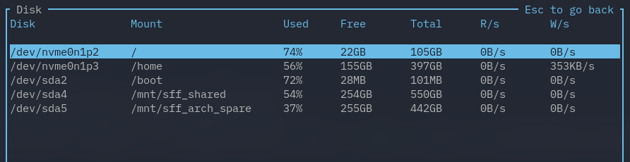

The following in the config file would filter out some entries by disk name:

```toml
[disk_filter]
is_list_ignored = true
list = ["/dev/sda"]
regex = true
case_sensitive = false
whole_word = false
```

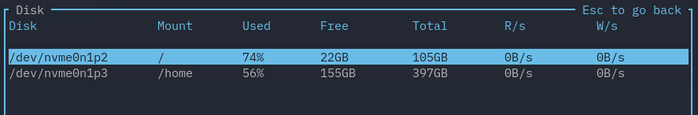

If there are two potentially conflicting filters (i.e. when you are using both a disk and mount filter), the filter that explicitly allows an entry takes precedence over a filter that explicitly denies one. So for example, let's say I set a disk filter accepting anything with `/dev/sda`, but deny anything with `/mnt/.*` or `/`. So to do so, I write in the config file:

```toml
[disk_filter]
is_list_ignored = false
list = ["/dev/sda"]
regex = true
case_sensitive = false
whole_word = false

[mount_filter]
is_list_ignored = true
list = ["/mnt/.*", "/"]
regex = true
case_sensitive = false
whole_word = true
```

Which gives me:

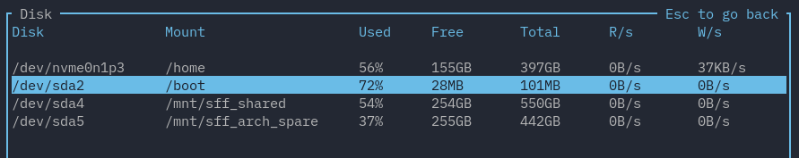

### Battery

You can get battery statistics (charge, time to fill/discharge, consumption in watts, and battery health) via the battery widget.

Since this is only useful for devices like laptops, it is off by default. You can either enable the widget in the default layout via the `--battery` flag, or by specifying the widget in a [layout](#layout):


## FAQ

Please see the [FAQ](./FAQ.md) for answers to frequently asked questions.

## Contribution

Contribution is always welcome! Please take a look at [CONTRIBUTING.md](./CONTRIBUTING.md) for details on how to help.

### Contributors

Thanks to all contributors ([emoji key](https://allcontributors.org/docs/en/emoji-key)):

<!-- ALL-CONTRIBUTORS-LIST:START - Do not remove or modify this section -->
<!-- prettier-ignore-start -->
<!-- markdownlint-disable -->
<table>
  <tr>
    <td align="center"><a href="http://shilangyu.github.io"><br /><sub><b>Marcin Wojnarowski</b></sub></a><br /><a href="https://github.com/ClementTsang/bottom/commits?author=shilangyu" title="Code">💻</a> <a href="#platform-shilangyu" title="Packaging/porting to new platform">📦</a></td>
    <td align="center"><a href="http://neosmart.net/"><br /><sub><b>Mahmoud Al-Qudsi</b></sub></a><br /><a href="https://github.com/ClementTsang/bottom/commits?author=mqudsi" title="Code">💻</a></td>
    <td align="center"><a href="https://andys8.de"><br /><sub><b>Andy</b></sub></a><br /><a href="https://github.com/ClementTsang/bottom/commits?author=andys8" title="Code">💻</a></td>
    <td align="center"><a href="https://github.com/HarHarLinks"><br /><sub><b>Kim Brose</b></sub></a><br /><a href="https://github.com/ClementTsang/bottom/commits?author=HarHarLinks" title="Code">💻</a></td>
    <td align="center"><a href="https://svenstaro.org"><br /><sub><b>Sven-Hendrik Haase</b></sub></a><br /><a href="https://github.com/ClementTsang/bottom/commits?author=svenstaro" title="Documentation">📖</a></td>
    <td align="center"><a href="https://liberapay.com/Artem4/"><br /><sub><b>Artem Polishchuk</b></sub></a><br /><a href="#platform-tim77" title="Packaging/porting to new platform">📦</a> <a href="https://github.com/ClementTsang/bottom/commits?author=tim77" title="Documentation">📖</a></td>
    <td align="center"><a href="http://ruby-journal.com/"><br /><sub><b>Trung Lê</b></sub></a><br /><a href="#platform-runlevel5" title="Packaging/porting to new platform">📦</a> <a href="#infra-runlevel5" title="Infrastructure (Hosting, Build-Tools, etc)">🚇</a></td>
  </tr>
  <tr>
    <td align="center"><a href="https://github.com/dm9pZCAq"><br /><sub><b>dm9pZCAq</b></sub></a><br /><a href="#platform-dm9pZCAq" title="Packaging/porting to new platform">📦</a> <a href="https://github.com/ClementTsang/bottom/commits?author=dm9pZCAq" title="Documentation">📖</a></td>
    <td align="center"><a href="https://lukor.org"><br /><sub><b>Lukas Rysavy</b></sub></a><br /><a href="https://github.com/ClementTsang/bottom/commits?author=LlinksRechts" title="Code">💻</a></td>
    <td align="center"><a href="http://hamberg.no/erlend"><br /><sub><b>Erlend Hamberg</b></sub></a><br /><a href="https://github.com/ClementTsang/bottom/commits?author=ehamberg" title="Code">💻</a></td>
    <td align="center"><a href="https://onee3.org"><br /><sub><b>Frederick Zhang</b></sub></a><br /><a href="https://github.com/ClementTsang/bottom/commits?author=Frederick888" title="Code">💻</a></td>
    <td align="center"><a href="https://github.com/pvanheus"><br /><sub><b>pvanheus</b></sub></a><br /><a href="https://github.com/ClementTsang/bottom/commits?author=pvanheus" title="Code">💻</a></td>
    <td align="center"><a href="https://zebulon.dev/"><br /><sub><b>Zeb Piasecki</b></sub></a><br /><a href="https://github.com/ClementTsang/bottom/commits?author=vlakreeh" title="Code">💻</a></td>
    <td align="center"><a href="https://github.com/georgybog"><br /><sub><b>georgybog</b></sub></a><br /><a href="https://github.com/ClementTsang/bottom/commits?author=georgybog" title="Documentation">📖</a></td>
  </tr>
  <tr>
    <td align="center"><a href="https://github.com/briandipalma"><br /><sub><b>Brian Di Palma</b></sub></a><br /><a href="https://github.com/ClementTsang/bottom/commits?author=briandipalma" title="Documentation">📖</a></td>
    <td align="center"><a href="https://dakyskye.github.io"><br /><sub><b>Lasha Kanteladze</b></sub></a><br /><a href="https://github.com/ClementTsang/bottom/commits?author=dakyskye" title="Documentation">📖</a></td>
  </tr>
</table>

<!-- markdownlint-restore -->
<!-- prettier-ignore-end -->

<!-- ALL-CONTRIBUTORS-LIST:END -->

## Thanks

- This project is very much inspired by [gotop](https://github.com/xxxserxxx/gotop),
  [ytop](https://github.com/cjbassi/ytop), [gtop](https://github.com/aksakalli/gtop), and [htop](https://github.com/htop-dev/htop/).

- This application was written with many, _many_ libraries, and built on the
  work of many talented people. This application would be impossible without their
  work. I used to thank them all individually but the list got too large...

- And of course, thanks to all contributors!
