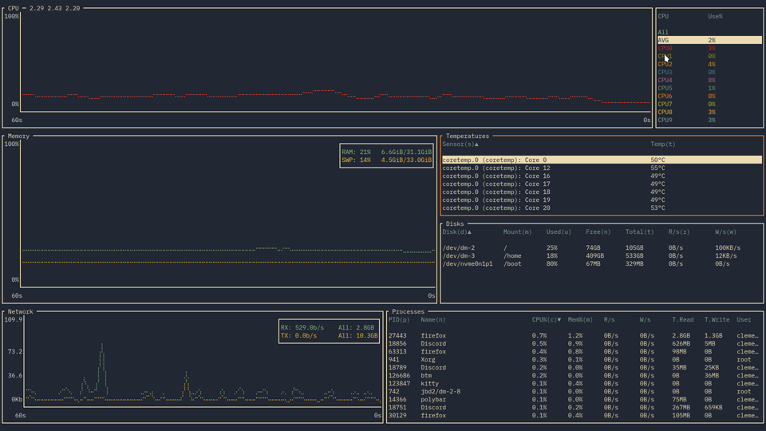

<div align="center">
  <h1>bottom (btm)</h1>

  <p>
    A customizable cross-platform graphical process/system monitor for the terminal.<br />Supports Linux, macOS, and Windows. Inspired by <a href=https://github.com/aksakalli/gtop>gtop</a>, <a href=https://github.com/xxxserxxx/gotop>gotop</a>, and <a href=https://github.com/htop-dev/htop>htop</a>.
  </p>

[](https://github.com/ClementTsang/bottom/actions?query=branch%3Amain)
[](https://crates.io/crates/bottom)
[](https://bottom.pages.dev/stable)
[](https://bottom.pages.dev/nightly)

</div>

<div align="center">
  
  <p>
    <sub>
      Demo using the <a href="https://github.com/morhetz/gruvbox">Gruvbox</a> theme (<code>--theme gruvbox</code>), along with <a href="https://www.ibm.com/plex/">IBM Plex Mono</a> and <a href="https://sw.kovidgoyal.net/kitty/">Kitty</a>
    </sub>
  </p>
</div>

## Table of contents <!-- omit in toc -->

- [Features](#features)
- [Support](#support)
  - [Official](#official)
  - [Unofficial](#unofficial)
- [Installation](#installation)
  - [Cargo](#cargo)
  - [Alpine](#alpine)
  - [Arch Linux](#arch-linux)
  - [Debian / Ubuntu](#debian--ubuntu)
  - [Exherbo Linux](#exherbo-linux)
  - [Fedora / CentOS / AlmaLinux / Rocky Linux](#fedora--centos--almalinux--rocky-linux)
  - [Gentoo](#gentoo)
  - [Nix](#nix)
  - [openSUSE](#opensuse)
  - [Snap](#snap)
  - [Solus](#solus)
  - [Void](#void)
  - [gah](#gah)
  - [Homebrew](#homebrew)
  - [MacPorts](#macports)
  - [Chocolatey](#chocolatey)
  - [Scoop](#scoop)
  - [winget](#winget)
  - [Windows installer](#windows-installer)
  - [Conda](#conda)
  - [mise](#mise)
  - [Pre-built binaries](#pre-built-binaries)
    - [Auto-completion](#auto-completion)
- [Usage](#usage)
- [Configuration](#configuration)
- [Troubleshooting](#troubleshooting)
- [Contribution](#contribution)
  - [Contributors](#contributors)
- [Thanks](#thanks)

## Features

As (yet another) process/system visualization and management application, bottom supports the typical features:

- Graphical visualization widgets for:

  - [CPU usage](https://bottom.pages.dev/nightly/usage/widgets/cpu/) over time, at an average and per-core level
  - [RAM and swap usage](https://bottom.pages.dev/nightly/usage/widgets/memory/) over time
  - [Network I/O usage](https://bottom.pages.dev/nightly/usage/widgets/network/) over time
  - GPU usage over time (NVIDIA, AMD, Intel)

  with support for zooming in/out the current time interval displayed.

- Widgets for displaying info about:

  - [Disk capacity/usage](https://bottom.pages.dev/nightly/usage/widgets/disk/)
  - [Temperature sensors](https://bottom.pages.dev/nightly/usage/widgets/temperature/)
  - [Battery usage](https://bottom.pages.dev/nightly/usage/widgets/battery/)

- [A process widget](https://bottom.pages.dev/nightly/usage/widgets/process/) for displaying, sorting, and searching info about processes, as well as support for:

  - [Kill signals](https://bottom.pages.dev/nightly/usage/widgets/process/#process-termination)
  - [Tree mode](https://bottom.pages.dev/nightly/usage/widgets/process/#tree-mode)

- [Cross-platform support](https://github.com/ClementTsang/bottom#support) for Linux, macOS, and Windows, with more planned in the future.

- [Customizable behaviour](https://bottom.pages.dev/nightly/configuration/command-line-options/) that can be controlled with command-line options or a config file, such as:

  - Custom and built-in colour themes
  - Customizing widget behaviour
  - Changing the layout of widgets
  - Filtering out entries in some widgets

- And more:

  - [An htop-inspired basic mode](https://bottom.pages.dev/nightly/usage/basic-mode/)
  - [Expansion, which focuses on just one widget](https://bottom.pages.dev/nightly/usage/general-usage/#expansion)

- And more!

You can find more details in [the documentation](https://bottom.pages.dev/nightly/usage/general-usage/).

## Support

### Official

bottom _officially_ supports the following operating systems and corresponding architectures:

- macOS (`x86_64`, `aarch64`)
- Linux (`x86_64`, `i686`, `aarch64`)
- Windows (`x86_64`, `i686`)

These platforms are tested to work for the most part and issues on these platforms will be fixed if possible.
Furthermore, binaries are built and tested using the most recent version of stable Rust at the time.

For more details on supported platforms and known problems, check out [the documentation](https://bottom.pages.dev/nightly/support/official/).

### Unofficial

bottom may work on a number of platforms that aren't officially supported. Note that unsupported platforms:

- Might not be tested in CI to build or pass tests (see [here](./.github/workflows/ci.yml) for checked platforms).
- Might not be properly tested by maintainers prior to a stable release.
- May only receive limited support, such as missing features or bugs that may not be fixed.

Note that some unsupported platforms may eventually be officially supported (e.g., FreeBSD).

A non-comprehensive list of some currently unofficially-supported platforms that may compile/work include:

- FreeBSD (`x86_64`)
- Linux (`armv6`, `armv7`, `powerpc64le`, `riscv64gc`)
- Android (`arm64`)

For more details on unsupported platforms and known problems, check out [the documentation](https://bottom.pages.dev/nightly/support/unofficial/).

## Installation

### Cargo

Installation via `cargo` can be done by installing the [`bottom`](https://crates.io/crates/bottom) crate:

```bash
# You might need to update the stable version of Rust first.
# Other versions might work, but this is not guaranteed.
rustup update stable

# Install the binary from crates.io.
cargo install bottom --locked

# If you use another channel by default, you can specify
# the what channel to use like so:
cargo +stable install bottom --locked

# --locked may be omitted if you wish to not use the
# locked crate versions in Cargo.lock. However, be
# aware that this may cause problems with dependencies.
cargo install bottom
```

Alternatively, you can use `cargo install` using the repo as the source.

```bash
# You might need to update the stable version of Rust first.
# Other versions might work, but this is not guaranteed.
rustup update stable

# Option 1 - Download an archive from releases and install
curl -LO https://github.com/ClementTsang/bottom/archive/0.11.4.tar.gz
tar -xzvf 0.11.4.tar.gz
cargo install --path . --locked

# Option 2 - Manually clone the repo and install
git clone https://github.com/ClementTsang/bottom
cd bottom
cargo install --path . --locked

# Option 3 - Install using cargo with the repo as the source
cargo install --git https://github.com/ClementTsang/bottom --locked

# You can also pass in the target-cpu=native flag to try to
# use better CPU-specific optimizations. For example:
RUSTFLAGS="-C target-cpu=native" cargo install --path . --locked
```

### Alpine

bottom is available as a [package](https://pkgs.alpinelinux.org/packages?name=bottom&branch=edge&repo=&arch=&origin=&flagged=&maintainer=) for Alpine Linux via `apk`:

```bash
apk add bottom
```

Packages for documentation ([`bottom-doc`](https://pkgs.alpinelinux.org/packages?name=bottom-doc&branch=edge&repo=&arch=&origin=&flagged=&maintainer=)) and completions for Bash ([`bottom-bash-completion`](https://pkgs.alpinelinux.org/packages?name=bottom-bash-completion&branch=edge&repo=&arch=&origin=&flagged=&maintainer=)), Fish ([`bottom-fish-completion`](https://pkgs.alpinelinux.org/packages?name=bottom-fish-completion&branch=edge&repo=&arch=&origin=&flagged=&maintainer=)), and Zsh ([`bottom-zsh-completion`](https://pkgs.alpinelinux.org/packages?name=bottom-zsh-completion&branch=edge&repo=&arch=&origin=&flagged=&maintainer=)) are also available.

### Arch Linux

bottom is available as an [official package](https://archlinux.org/packages/extra/x86_64/bottom/) that can be installed with `pacman`:

```bash
sudo pacman -S bottom
```

If you want the latest changes that are not yet stable, you can also install `bottom-git` [from the AUR](https://aur.archlinux.org/packages/bottom-git):

```bash
# Using paru
paru -S bottom-git

# Using yay
yay -S bottom-git
```

### Debian / Ubuntu

A `.deb` file is provided on each [stable release](https://github.com/ClementTsang/bottom/releases/latest) and
[nightly builds](https://github.com/ClementTsang/bottom/releases/tag/nightly) for x86, aarch64, and armv7.
Some examples of installing it this way:

```bash
# x86-64
curl -LO https://github.com/ClementTsang/bottom/releases/download/0.11.4/bottom_0.11.4-1_amd64.deb
sudo dpkg -i bottom_0.11.4-1_amd64.deb

# ARM64
curl -LO https://github.com/ClementTsang/bottom/releases/download/0.11.4/bottom_0.11.4-1_arm64.deb
sudo dpkg -i bottom_0.11.4-1_arm64.deb

# ARM
curl -LO https://github.com/ClementTsang/bottom/releases/download/0.11.4/bottom_0.11.4-1_armhf.deb
sudo dpkg -i bottom_0.11.4-1_armhf.deb

# musl-based
curl -LO https://github.com/ClementTsang/bottom/releases/download/0.11.4/bottom-musl_0.11.4-1_amd64.deb
sudo dpkg -i bottom-musl_0.11.4-1_amd64.deb
```

### Exherbo Linux

bottom is available as a [rust package](https://gitlab.exherbo.org/exherbo/rust/-/tree/master/packages/sys-process/bottom) that can be installed with `cave`:

```bash
cave resolve -x repository/rust
cave resolve -x bottom
```

### Fedora / CentOS / AlmaLinux / Rocky Linux

bottom is available on [COPR](https://copr.fedorainfracloud.org/coprs/atim/bottom/):

```bash
sudo dnf copr enable atim/bottom -y
sudo dnf install bottom
```

bottom is also available via [Terra](https://terra.fyralabs.com/):

```bash
sudo dnf install --repofrompath 'terra,https://repos.fyralabs.com/terra$releasever' --setopt='terra.gpgkey=https://repos.fyralabs.com/terra$releasever/key.asc' terra-release
sudo dnf install bottom
```

`.rpm` files are also generated for x86 in the [releases](https://github.com/ClementTsang/bottom/releases) page.
For example:

```bash
curl -LO https://github.com/ClementTsang/bottom/releases/download/0.11.4/bottom-0.11.4-1.x86_64.rpm
sudo rpm -i bottom-0.11.4-1.x86_64.rpm
```

### Gentoo

Available in the [official Gentoo repo](https://packages.gentoo.org/packages/sys-process/bottom):

```bash
sudo emerge --ask sys-process/bottom
```

### Nix

Available [in Nixpkgs](https://search.nixos.org/packages?channel=unstable&show=bottom&from=0&size=1&sort=relevance&type=packages) as `bottom`:

```bash
nix profile install nixpkgs#bottom
```

`bottom` can also be installed and configured through the [home-manager](https://nix-community.github.io/home-manager) module:

```nix
{
  programs.bottom.enable = true;
}
```

### openSUSE

Available in openSUSE Tumbleweed:

```bash
zypper in bottom
```

### Snap

bottom is available as a [snap](https://snapcraft.io/install/bottom/ubuntu):

```bash
sudo snap install bottom

# To allow the program to run as intended
sudo snap connect bottom:mount-observe
sudo snap connect bottom:hardware-observe
sudo snap connect bottom:system-observe
sudo snap connect bottom:process-control
```

### Solus

Available [in the Solus repos](https://dev.getsol.us/source/bottom/):

```bash
sudo eopkg it bottom
```

### Void

Available [in the void-packages repo](https://github.com/void-linux/void-packages/tree/master/srcpkgs/bottom):

```bash
sudo xbps-install bottom
```

### gah

bottom can also be installed on Linux or macOS using [gah](https://github.com/marverix/gah):

```bash
gah install bottom
```

### Homebrew

Formula available [here](https://formulae.brew.sh/formula/bottom):

```bash
brew install bottom
```

### MacPorts

Available [here](https://ports.macports.org/port/bottom/):

```bash
sudo port selfupdate
sudo port install bottom
```

### Chocolatey

Chocolatey packages are located [here](https://chocolatey.org/packages/bottom):

```bash
choco install bottom
```

### Scoop

Available in the [Main bucket](https://github.com/ScoopInstaller/Main):

```bash
scoop install bottom
```

### winget

The winget package can be found [here](https://github.com/microsoft/winget-pkgs/tree/master/manifests/c/Clement/bottom):

```bash
winget install bottom

# If you need a more specific app id:
winget install Clement.bottom
```

You can uninstall via Control Panel, Options, or `winget --uninstall bottom`.

### Windows installer

You can also manually install bottom as a Windows program by going to the [latest release](https://github.com/ClementTsang/bottom/releases/latest)
and installing via the `.msi` file.

### Conda

You can install bottom using `conda` with [this conda-smithy repository](https://github.com/conda-forge/bottom-feedstock):

```bash
# Add the channel
conda config --add channels conda-forge
conda config --set channel_priority strict

# Install
conda install bottom
```

### mise

bottom is available in [mise](https://github.com/jdx/mise). You can install it with something like:

```
mise use -g bottom@latest
```

### Pre-built binaries

You can also use the pre-built release binaries:

- [Latest stable release](https://github.com/ClementTsang/bottom/releases/latest), built using the release branch
- [Latest nightly release](https://github.com/ClementTsang/bottom/releases/tag/nightly), built using the `main` branch at 00:00 UTC daily

To use, download and extract the binary that matches your system. You can then run by doing:

```bash
./btm
```

or by installing to your system following the procedures for installing binaries to your system.

#### Auto-completion

The release binaries in [the releases page](https://github.com/ClementTsang/bottom/releases) are packaged with
shell auto-completion files for Bash, Zsh, fish, Powershell, Elvish, Fig, and Nushell. To install them:

- For Bash, move `btm.bash` to `$XDG_CONFIG_HOME/bash_completion or /etc/bash_completion.d/`.
- For Zsh, move `_btm` to one of your `$fpath` directories.
- For fish, move `btm.fish` to `$HOME/.config/fish/completions/`.
- For PowerShell, add `_btm.ps1` to your PowerShell [profile](<https://docs.microsoft.com/en-us/previous-versions//bb613488(v=vs.85)>).
- For Elvish, the completion file is `btm.elv`.
- For Fig, the completion file is `btm.ts`.
- For Nushell, source `btm.nu`.

The individual auto-completion files are also included in the stable/nightly releases as `completion.tar.gz` if needed.

## Usage

You can run bottom using `btm`.

- For help on flags, use `btm -h` for a quick overview or `btm --help` for more details.
- For info on key and mouse bindings, press `?` inside bottom or refer to the [documentation page](https://bottom.pages.dev/nightly/).

You can find more information on usage in the [documentation](https://bottom.pages.dev/nightly/).

## Configuration

bottom accepts a number of command-line arguments to change the behaviour of the application as desired.
Additionally, bottom will automatically generate a configuration file on the first launch, which can be changed.

More details on configuration can be found [in the documentation](https://bottom.pages.dev/nightly/configuration/config-file/).

## Troubleshooting

If some things aren't working, give the [troubleshooting page](https://bottom.pages.dev/nightly/troubleshooting)
a look. If things still aren't working, then consider asking [a question](https://github.com/ClementTsang/bottom/discussions)
or filing a [bug report](https://github.com/ClementTsang/bottom/issues/new/choose) if you think it's a bug.

## Contribution

Whether it's reporting bugs, suggesting features, maintaining packages, or submitting a PR,
contribution is always welcome! Please read [CONTRIBUTING.md](./CONTRIBUTING.md) for details on how to
contribute to bottom.

### Contributors

Thanks to all contributors:

<!-- ALL-CONTRIBUTORS-LIST:START - Do not remove or modify this section -->
<!-- prettier-ignore-start -->
<!-- markdownlint-disable -->
<table>
  <tbody>
    <tr>
      <td align="center" valign="top" width="14.28%"><a href="http://shilangyu.github.io"><br /><sub><b>Marcin Wojnarowski</b></sub></a><br /><a href="https://github.com/ClementTsang/bottom/commits?author=shilangyu" title="Code">💻</a> <a href="#platform-shilangyu" title="Packaging/porting to new platform">📦</a></td>
      <td align="center" valign="top" width="14.28%"><a href="http://neosmart.net/"><br /><sub><b>Mahmoud Al-Qudsi</b></sub></a><br /><a href="https://github.com/ClementTsang/bottom/commits?author=mqudsi" title="Code">💻</a></td>
      <td align="center" valign="top" width="14.28%"><a href="https://andys8.de"><br /><sub><b>Andy</b></sub></a><br /><a href="https://github.com/ClementTsang/bottom/commits?author=andys8" title="Code">💻</a></td>
      <td align="center" valign="top" width="14.28%"><a href="https://github.com/HarHarLinks"><br /><sub><b>Kim Brose</b></sub></a><br /><a href="https://github.com/ClementTsang/bottom/commits?author=HarHarLinks" title="Code">💻</a></td>
      <td align="center" valign="top" width="14.28%"><a href="https://svenstaro.org"><br /><sub><b>Sven-Hendrik Haase</b></sub></a><br /><a href="https://github.com/ClementTsang/bottom/commits?author=svenstaro" title="Documentation">📖</a></td>
      <td align="center" valign="top" width="14.28%"><a href="https://liberapay.com/Artem4/"><br /><sub><b>Artem Polishchuk</b></sub></a><br /><a href="#platform-tim77" title="Packaging/porting to new platform">📦</a> <a href="https://github.com/ClementTsang/bottom/commits?author=tim77" title="Documentation">📖</a></td>
      <td align="center" valign="top" width="14.28%"><a href="http://ruby-journal.com/"><br /><sub><b>Trung Lê</b></sub></a><br /><a href="#platform-runlevel5" title="Packaging/porting to new platform">📦</a> <a href="#infra-runlevel5" title="Infrastructure (Hosting, Build-Tools, etc)">🚇</a></td>
    </tr>
    <tr>
      <td align="center" valign="top" width="14.28%"><a href="https://github.com/dm9pZCAq"><br /><sub><b>dm9pZCAq</b></sub></a><br /><a href="#platform-dm9pZCAq" title="Packaging/porting to new platform">📦</a> <a href="https://github.com/ClementTsang/bottom/commits?author=dm9pZCAq" title="Documentation">📖</a></td>
      <td align="center" valign="top" width="14.28%"><a href="https://lukor.org"><br /><sub><b>Lukas Rysavy</b></sub></a><br /><a href="https://github.com/ClementTsang/bottom/commits?author=LlinksRechts" title="Code">💻</a></td>
      <td align="center" valign="top" width="14.28%"><a href="http://hamberg.no/erlend"><br /><sub><b>Erlend Hamberg</b></sub></a><br /><a href="https://github.com/ClementTsang/bottom/commits?author=ehamberg" title="Code">💻</a></td>
      <td align="center" valign="top" width="14.28%"><a href="https://onee3.org"><br /><sub><b>Frederick Zhang</b></sub></a><br /><a href="https://github.com/ClementTsang/bottom/commits?author=Frederick888" title="Code">💻</a></td>
      <td align="center" valign="top" width="14.28%"><a href="https://github.com/pvanheus"><br /><sub><b>pvanheus</b></sub></a><br /><a href="https://github.com/ClementTsang/bottom/commits?author=pvanheus" title="Code">💻</a></td>
      <td align="center" valign="top" width="14.28%"><a href="https://github.com/briandipalma"><br /><sub><b>Brian Di Palma</b></sub></a><br /><a href="https://github.com/ClementTsang/bottom/commits?author=briandipalma" title="Documentation">📖</a></td>
      <td align="center" valign="top" width="14.28%"><a href="https://dakyskye.github.io"><br /><sub><b>Lasha Kanteladze</b></sub></a><br /><a href="https://github.com/ClementTsang/bottom/commits?author=dakyskye" title="Documentation">📖</a></td>
    </tr>
    <tr>
      <td align="center" valign="top" width="14.28%"><a href="https://github.com/herbygillot"><br /><sub><b>Herby Gillot</b></sub></a><br /><a href="https://github.com/ClementTsang/bottom/commits?author=herbygillot" title="Documentation">📖</a></td>
      <td align="center" valign="top" width="14.28%"><a href="https://github.com/yellowsquid"><br /><sub><b>Greg Brown</b></sub></a><br /><a href="https://github.com/ClementTsang/bottom/commits?author=yellowsquid" title="Code">💻</a></td>
      <td align="center" valign="top" width="14.28%"><a href="https://github.com/TotalCaesar659"><br /><sub><b>TotalCaesar659</b></sub></a><br /><a href="https://github.com/ClementTsang/bottom/commits?author=TotalCaesar659" title="Documentation">📖</a></td>
      <td align="center" valign="top" width="14.28%"><a href="https://github.com/grawlinson"><br /><sub><b>George Rawlinson</b></sub></a><br /><a href="https://github.com/ClementTsang/bottom/commits?author=grawlinson" title="Documentation">📖</a> <a href="#platform-grawlinson" title="Packaging/porting to new platform">📦</a></td>
      <td align="center" valign="top" width="14.28%"><a href="https://www.frogorbits.com/"><br /><sub><b>adiabatic</b></sub></a><br /><a href="https://github.com/ClementTsang/bottom/commits?author=adiabatic" title="Documentation">📖</a></td>
      <td align="center" valign="top" width="14.28%"><a href="https://electronsweatshop.com"><br /><sub><b>Randy Barlow</b></sub></a><br /><a href="https://github.com/ClementTsang/bottom/commits?author=bowlofeggs" title="Code">💻</a></td>
      <td align="center" valign="top" width="14.28%"><a href="http://jackson.dev"><br /><sub><b>Patrick Jackson</b></sub></a><br /><a href="#ideas-patricksjackson" title="Ideas, Planning, & Feedback">🤔</a> <a href="https://github.com/ClementTsang/bottom/commits?author=patricksjackson" title="Documentation">📖</a></td>
    </tr>
    <tr>
      <td align="center" valign="top" width="14.28%"><a href="https://github.com/mati865"><br /><sub><b>Mateusz Mikuła</b></sub></a><br /><a href="https://github.com/ClementTsang/bottom/commits?author=mati865" title="Code">💻</a></td>
      <td align="center" valign="top" width="14.28%"><a href="https://blog.guillaume-gomez.fr"><br /><sub><b>Guillaume Gomez</b></sub></a><br /><a href="https://github.com/ClementTsang/bottom/commits?author=GuillaumeGomez" title="Code">💻</a></td>
      <td align="center" valign="top" width="14.28%"><a href="https://github.com/shurizzle"><br /><sub><b>shura</b></sub></a><br /><a href="https://github.com/ClementTsang/bottom/commits?author=shurizzle" title="Code">💻</a></td>
      <td align="center" valign="top" width="14.28%"><a href="https://www.wezm.net/"><br /><sub><b>Wesley Moore</b></sub></a><br /><a href="https://github.com/ClementTsang/bottom/commits?author=wezm" title="Code">💻</a></td>
      <td align="center" valign="top" width="14.28%"><a href="https://github.com/xgdgsc"><br /><sub><b>xgdgsc</b></sub></a><br /><a href="https://github.com/ClementTsang/bottom/commits?author=xgdgsc" title="Documentation">📖</a></td>
      <td align="center" valign="top" width="14.28%"><a href="https://github.com/ViridiCanis"><br /><sub><b>ViridiCanis</b></sub></a><br /><a href="https://github.com/ClementTsang/bottom/commits?author=ViridiCanis" title="Code">💻</a></td>
      <td align="center" valign="top" width="14.28%"><a href="https://github.com/jamartin9"><br /><sub><b>Justin Martin</b></sub></a><br /><a href="https://github.com/ClementTsang/bottom/commits?author=jamartin9" title="Code">💻</a> <a href="https://github.com/ClementTsang/bottom/commits?author=jamartin9" title="Documentation">📖</a></td>
    </tr>
    <tr>
      <td align="center" valign="top" width="14.28%"><a href="https://github.com/DianaNites"><br /><sub><b>Diana</b></sub></a><br /><a href="https://github.com/ClementTsang/bottom/commits?author=DianaNites" title="Code">💻</a></td>
      <td align="center" valign="top" width="14.28%"><a href="https://hervyqa.id"><br /><sub><b>Hervy Qurrotul Ainur Rozi</b></sub></a><br /><a href="https://github.com/ClementTsang/bottom/commits?author=hervyqa" title="Documentation">📖</a></td>
      <td align="center" valign="top" width="14.28%"><a href="https://mrivnak.github.io"><br /><sub><b>Mike Rivnak</b></sub></a><br /><a href="https://github.com/ClementTsang/bottom/commits?author=mrivnak" title="Documentation">📖</a></td>
      <td align="center" valign="top" width="14.28%"><a href="https://github.com/lroobrou"><br /><sub><b>lroobrou</b></sub></a><br /><a href="https://github.com/ClementTsang/bottom/commits?author=lroobrou" title="Code">💻</a></td>
      <td align="center" valign="top" width="14.28%"><a href="https://cube64128.xyz/"><br /><sub><b>database64128</b></sub></a><br /><a href="https://github.com/ClementTsang/bottom/commits?author=database64128" title="Code">💻</a></td>
      <td align="center" valign="top" width="14.28%"><a href="https://github.com/sou-chon"><br /><sub><b>Chon Sou</b></sub></a><br /><a href="https://github.com/ClementTsang/bottom/commits?author=sou-chon" title="Code">💻</a></td>
      <td align="center" valign="top" width="14.28%"><a href="https://github.com/Drsheppard01"><br /><sub><b>DrSheppard</b></sub></a><br /><a href="https://github.com/ClementTsang/bottom/commits?author=Drsheppard01" title="Documentation">📖</a></td>
    </tr>
    <tr>
      <td align="center" valign="top" width="14.28%"><a href="https://github.com/RaresCon"><br /><sub><b>Rareș Constantin</b></sub></a><br /><a href="https://github.com/ClementTsang/bottom/commits?author=RaresCon" title="Code">💻</a></td>
      <td align="center" valign="top" width="14.28%"><a href="http://felipesuri.com"><br /><sub><b>felipesuri</b></sub></a><br /><a href="https://github.com/ClementTsang/bottom/commits?author=felipesuri" title="Documentation">📖</a></td>
      <td align="center" valign="top" width="14.28%"><a href="https://github.com/spital"><br /><sub><b>spital</b></sub></a><br /><a href="https://github.com/ClementTsang/bottom/commits?author=spital" title="Code">💻</a></td>
      <td align="center" valign="top" width="14.28%"><a href="https://bikodbg.com/"><br /><sub><b>Michael Bikovitsky</b></sub></a><br /><a href="https://github.com/ClementTsang/bottom/commits?author=mbikovitsky" title="Code">💻</a></td>
      <td align="center" valign="top" width="14.28%"><a href="https://github.com/dvalter"><br /><sub><b>Dmitry Valter</b></sub></a><br /><a href="https://github.com/ClementTsang/bottom/commits?author=dvalter" title="Code">💻</a></td>
      <td align="center" valign="top" width="14.28%"><a href="https://github.com/aragonnetje6"><br /><sub><b>Grace Stok</b></sub></a><br /><a href="https://github.com/ClementTsang/bottom/commits?author=aragonnetje6" title="Code">💻</a></td>
      <td align="center" valign="top" width="14.28%"><a href="https://github.com/yshui"><br /><sub><b>Yuxuan Shui</b></sub></a><br /><a href="https://github.com/ClementTsang/bottom/commits?author=yshui" title="Code">💻</a></td>
    </tr>
    <tr>
      <td align="center" valign="top" width="14.28%"><a href="http://zongwenqing.com"><br /><sub><b>Wenqing Zong</b></sub></a><br /><a href="https://github.com/ClementTsang/bottom/commits?author=WenqingZong" title="Code">💻</a></td>
      <td align="center" valign="top" width="14.28%"><a href="http://gabelluardo.github.io"><br /><sub><b>Gabriele Belluardo</b></sub></a><br /><a href="https://github.com/ClementTsang/bottom/commits?author=gabelluardo" title="Code">💻</a></td>
      <td align="center" valign="top" width="14.28%"><a href="https://zebulon.dev/"><br /><sub><b>Zeb Piasecki</b></sub></a><br /><a href="https://github.com/ClementTsang/bottom/commits?author=zebp" title="Code">💻</a></td>
      <td align="center" valign="top" width="14.28%"><a href="https://freed-wu.github.io/"><br /><sub><b>wzy</b></sub></a><br /><a href="https://github.com/ClementTsang/bottom/commits?author=Freed-Wu" title="Code">💻</a> <a href="https://github.com/ClementTsang/bottom/commits?author=Freed-Wu" title="Documentation">📖</a></td>
      <td align="center" valign="top" width="14.28%"><a href="https://johnlin.ca/"><br /><sub><b>john-s-lin</b></sub></a><br /><a href="https://github.com/ClementTsang/bottom/commits?author=john-s-lin" title="Documentation">📖</a></td>
      <td align="center" valign="top" width="14.28%"><a href="https://github.com/lyuha"><br /><sub><b>Lee Wonjoon</b></sub></a><br /><a href="https://github.com/ClementTsang/bottom/commits?author=lyuha" title="Code">💻</a> <a href="https://github.com/ClementTsang/bottom/commits?author=lyuha" title="Documentation">📖</a></td>
      <td align="center" valign="top" width="14.28%"><a href="https://www.davlgd.fr"><br /><sub><b>David Legrand</b></sub></a><br /><a href="https://github.com/ClementTsang/bottom/commits?author=davlgd" title="Documentation">📖</a></td>
    </tr>
    <tr>
      <td align="center" valign="top" width="14.28%"><a href="https://github.com/MichalBryxi"><br /><sub><b>Michal Bryxí</b></sub></a><br /><a href="https://github.com/ClementTsang/bottom/commits?author=MichalBryxi" title="Documentation">📖</a></td>
      <td align="center" valign="top" width="14.28%"><a href="http://mpia.de/~hviding/"><br /><sub><b>Raphael Erik Hviding</b></sub></a><br /><a href="https://github.com/ClementTsang/bottom/commits?author=TheSkyentist" title="Code">💻</a></td>
      <td align="center" valign="top" width="14.28%"><a href="http://cosmichorror.dev"><br /><sub><b>CosmicHorror</b></sub></a><br /><a href="https://github.com/ClementTsang/bottom/commits?author=CosmicHorrorDev" title="Code">💻</a></td>
      <td align="center" valign="top" width="14.28%"><a href="https://www.woods.am/"><br /><sub><b>Ben Woods</b></sub></a><br /><a href="https://github.com/ClementTsang/bottom/commits?author=woodsb02" title="Documentation">📖</a></td>
      <td align="center" valign="top" width="14.28%"><a href="http://cgdct.moe"><br /><sub><b>Stephen Huan</b></sub></a><br /><a href="https://github.com/ClementTsang/bottom/commits?author=stephen-huan" title="Code">💻</a></td>
      <td align="center" valign="top" width="14.28%"><a href="https://github.com/jasongwartz"><br /><sub><b>Jason Gwartz</b></sub></a><br /><a href="https://github.com/ClementTsang/bottom/commits?author=jasongwartz" title="Documentation">📖</a></td>
      <td align="center" valign="top" width="14.28%"><a href="https://github.com/llc0930"><br /><sub><b>llc0930</b></sub></a><br /><a href="https://github.com/ClementTsang/bottom/commits?author=llc0930" title="Code">💻</a></td>
    </tr>
    <tr>
      <td align="center" valign="top" width="14.28%"><a href="https://chronovore.dev"><br /><sub><b>Ada Ahmed</b></sub></a><br /><a href="https://github.com/ClementTsang/bottom/commits?author=yretenai" title="Code">💻</a></td>
      <td align="center" valign="top" width="14.28%"><a href="https://github.com/Wateir"><br /><sub><b>Wateir</b></sub></a><br /><a href="https://github.com/ClementTsang/bottom/commits?author=Wateir" title="Documentation">📖</a></td>
      <td align="center" valign="top" width="14.28%"><a href="https://github.com/al42and"><br /><sub><b>Andrey Alekseenko</b></sub></a><br /><a href="https://github.com/ClementTsang/bottom/commits?author=al42and" title="Code">💻</a></td>
      <td align="center" valign="top" width="14.28%"><a href="http://fgimian.github.io/"><br /><sub><b>Fotis Gimian</b></sub></a><br /><a href="https://github.com/ClementTsang/bottom/commits?author=fgimian" title="Code">💻</a> <a href="https://github.com/ClementTsang/bottom/commits?author=fgimian" title="Documentation">📖</a></td>
      <td align="center" valign="top" width="14.28%"><a href="https://sigmasquadron.net"><br /><sub><b>Fernando Rodrigues</b></sub></a><br /><a href="https://github.com/ClementTsang/bottom/commits?author=SigmaSquadron" title="Documentation">📖</a></td>
      <td align="center" valign="top" width="14.28%"><a href="https://mtoohey.com"><br /><sub><b>Matthew Toohey</b></sub></a><br /><a href="https://github.com/ClementTsang/bottom/commits?author=mtoohey31" title="Code">💻</a></td>
      <td align="center" valign="top" width="14.28%"><a href="https://meander.site"><br /><sub><b>Julius Enriquez</b></sub></a><br /><a href="https://github.com/ClementTsang/bottom/commits?author=win8linux" title="Documentation">📖</a></td>
    </tr>
    <tr>
      <td align="center" valign="top" width="14.28%"><a href="https://github.com/benjamb"><br /><sub><b>Ben Brown</b></sub></a><br /><a href="https://github.com/ClementTsang/bottom/commits?author=benjamb" title="Code">💻</a></td>
      <td align="center" valign="top" width="14.28%"><a href="https://github.com/nyurik"><br /><sub><b>Yuri Astrakhan</b></sub></a><br /><a href="https://github.com/ClementTsang/bottom/commits?author=nyurik" title="Code">💻</a> <a href="https://github.com/ClementTsang/bottom/commits?author=nyurik" title="Documentation">📖</a></td>
      <td align="center" valign="top" width="14.28%"><a href="https://kachick.github.io/"><br /><sub><b>Kenichi Kamiya</b></sub></a><br /><a href="https://github.com/ClementTsang/bottom/commits?author=kachick" title="Code">💻</a></td>
      <td align="center" valign="top" width="14.28%"><a href="https://github.com/yahlia"><br /><sub><b>yahlia</b></sub></a><br /><a href="https://github.com/ClementTsang/bottom/commits?author=yahlia" title="Code">💻</a></td>
      <td align="center" valign="top" width="14.28%"><a href="https://github.com/Bucket-Bucket-Bucket"><br /><sub><b>Bucket-Bucket-Bucket</b></sub></a><br /><a href="https://github.com/ClementTsang/bottom/commits?author=Bucket-Bucket-Bucket" title="Code">💻</a></td>
      <td align="center" valign="top" width="14.28%"><a href="http://marek.sierocinscy.pl"><br /><sub><b>Marek Sierociński</b></sub></a><br /><a href="https://github.com/ClementTsang/bottom/commits?author=marverix" title="Documentation">📖</a></td>
      <td align="center" valign="top" width="14.28%"><a href="https://github.com/Tommimon"><br /><sub><b>Tommaso Montanari</b></sub></a><br /><a href="#design-Tommimon" title="Design">🎨</a> <a href="#ideas-Tommimon" title="Ideas, Planning, & Feedback">🤔</a></td>
    </tr>
    <tr>
      <td align="center" valign="top" width="14.28%"><a href="http://blog.lenhof.eu.org"><br /><sub><b>Jean-Yves LENHOF</b></sub></a><br /><a href="https://github.com/ClementTsang/bottom/commits?author=jylenhof" title="Documentation">📖</a></td>
      <td align="center" valign="top" width="14.28%"><a href="http://saphereye.github.io"><br /><sub><b>Adarsh Das</b></sub></a><br /><a href="https://github.com/ClementTsang/bottom/commits?author=Saphereye" title="Code">💻</a> <a href="https://github.com/ClementTsang/bottom/commits?author=Saphereye" title="Documentation">📖</a></td>
      <td align="center" valign="top" width="14.28%"><a href="https://github.com/oxyzenQ"><br /><sub><b>rezky_nightky</b></sub></a><br /><a href="https://github.com/ClementTsang/bottom/commits?author=oxyzenQ" title="Documentation">📖</a></td>
      <td align="center" valign="top" width="14.28%"><a href="https://github.com/gitgoggles"><br /><sub><b>gitgoggles</b></sub></a><br /><a href="https://github.com/ClementTsang/bottom/commits?author=gitgoggles" title="Code">💻</a></td>
    </tr>
  </tbody>
</table>

<!-- markdownlint-restore -->
<!-- prettier-ignore-end -->

<!-- ALL-CONTRIBUTORS-LIST:END -->

## Thanks

- This project is very much inspired by [gotop](https://github.com/xxxserxxx/gotop),
  [gtop](https://github.com/aksakalli/gtop), and [htop](https://github.com/htop-dev/htop/).

- This application was written with [many](https://github.com/ClementTsang/bottom/blob/main/Cargo.toml),
  [_many_ libraries](https://github.com/ClementTsang/bottom/blob/main/Cargo.lock), as well as many services and
  programs, all built on top of the work of many talented people. bottom would not exist without all of this.

- And of course, thank you again to all contributors and package maintainers!

- I also really appreciate anyone who has used bottom, and those
  who go out of their way to report bugs or suggest ways to improve things. I hope
  it's been a useful tool for others.

- To those who support my work financially via donations, thank you so much.

- Also thanks to JetBrains for providing access to tools that I use to develop bottom
  as part of their [open source support program](https://jb.gg/OpenSourceSupport).

  <a href="https://jb.gg/OpenSourceSupport">
    
  </a>
