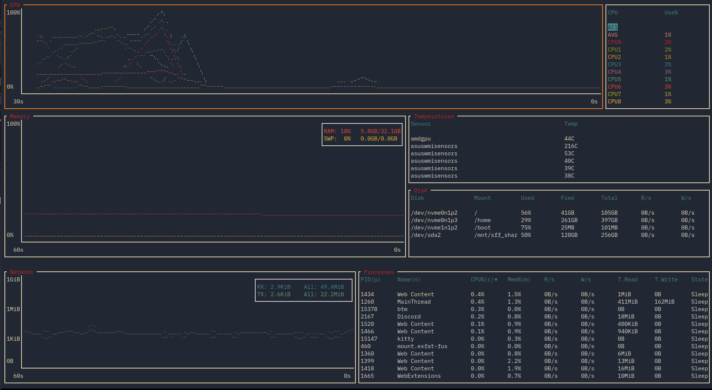

# bottom

 

A graphical top clone, written in Rust. Inspired by both [gtop](https://github.com/aksakalli/gtop) and [gotop](https://github.com/cjbassi/gotop). Supports Linux, macOS, and Windows.

 _Terminal: Kitty Terminal, Font: IBM Plex Mono, OS: Arch Linux. Theme based on [gruvbox](https://github.com/morhetz/gruvbox) (see sample config)._

## Features

Features of bottom include:

- CPU widget to show a visual representation of per-core (and optionally average) usage.

- Memory widget to show a visual representation of both RAM and SWAP usage.

- Networks widget to show a log-based visual representation of network usage.

- Sortable and searchable process widget. Searching supports regex, and you can search by PID and process name.

- Disks widget to display usage and I/O per second.

- Temperature widget to monitor detected sensors in your system.

- Config file support for custom colours and default options.

- Maximizing of widgets of interest to take up the entire window.

More details about each widget and compatibility can be found [here](./docs/widgets.md).

## Installation

In all cases you can install the in-development version by cloning and using `cargo build --release`. Note this is built and tested with Rust Stable (1.41.0 as of writing). You can also get release versions using `cargo install bottom`, or manually building from the [Releases](https://github.com/ClementTsang/bottom/releases) page by downloading and building.

### Linux

Other installation methods based on distros are as follows:

#### Arch Linux

You can get the release versions from the AUR by installing `bottom`.

#### Ubuntu

TBD

### Windows

I advise running the program with the `--dot_marker` or `-m` option, as the braille font seems to not work out of the box on Powershell. You may need to install a font like [FreeMono](https://fonts2u.com/free-monospaced.font) and use a terminal like cmder for font support to work properly, unfortunately.

I plan to add a Chocolatey install option in the future.

### macOS

macOS seems to work fine for the most part, barring minor issues with the `Ctrl`-arrow key bindings (use `Shift` instead). I plan to add a Homebrew install option in the future.

## Usage

Run using `btm`.

### Command line options

- `-h`, `--help` shows the help screen and exits.

- `-a`, `--avg_cpu` enables also showing the average CPU usage in addition to per-core CPU usage.

- `-m`, `--dot-marker` uses a dot marker instead of the default braille marker.

- Temperature units (you can only use one at a time):

  - `-c`, `--celsius` displays the temperature type in Celsius. This is the default.

  - `-f`, `--fahrenheit` displays the temperature type in Fahrenheit.

  - `-k`, `--kelvin` displays the temperature type in Kelvin.

- `-v`, `--version` displays the version number and exits.

- `-r <RATE>`, `--rate <RATE>` will set the refresh rate in _milliseconds_. Lowest it can go is 250ms, the highest it can go is 2128 - 1. Defaults to 1000ms, and lower values may take more resources due to more frequent polling of data, and may be less accurate in some circumstances.

- `-l`, `--left_legend` will move external table legends to the left side rather than the right side. Right side is default.

- `-u`, `--current_usage` will make a process' CPU usage be based on the current total CPU usage, rather than assuming 100% CPU usage.

- `-g`, `--group` will group together processes with the same name by default (equivalent to pressing `Tab`).

- `-S`, `--case_sensitive` will default to matching case.

- `-W`, `--whole` will default to searching for the world word.

- `-R`, `--regex` will default to using regex.

- `--cpu_default`, `--memory_default`, `--disk_default`, `--temperature_default`, `--network_default`, `--process_default` will select the corresponding widget on startup. By default the process widget is selected.

- `-s`, `--show_disabled_data` will show data entries in the graph legends even if the lines for that entry are disabled.

- `-C`, `--config` takes in a file path leading to a TOML file.

### Config files

The ability to use config files is supported by bottom to set boot flags by default, and set colour options. See [this document](./docs/config.md) for more details.

See this [config](./sample_config.toml) for an example.

### Keybindings

#### General

- `q`, `Ctrl-c` to quit. Note if you are currently in the search widget, `q` will not work so you can still type.

- `Esc` to close a dialog window, widget, or exit maximized mode.

- `Ctrl-r` to reset the screen and reset all collected data.

- `f` to freeze the screen from updating with new data. Press `f` again to unfreeze. Note that monitoring will still continue in the background.

- `Ctrl/Shift`-arrow or `H/J/K/L` to navigate between widgets. **Note that on macOS, some keybindings may collide with existing ones; `H/J/K/L` should work however.**

- `Up` or `k` and `Down` or `j` scrolls through the list if the widget is a table (Temperature, Disks, Processes).

- `?` to get a help screen explaining the controls. Note all controls except `Esc` to close the dialog will be disabled while this is open.

- `gg` or `Home` to jump to the first entry of the current table.

- `G` (`Shift-g`) or `End` to jump to the last entry of the current table.

- `Enter` on a widget to maximize the widget.

#### CPU

- `/` to allow for enabling/disabling showing certain cores with `Space`.

#### Processes

- `dd` to kill the selected process

- `c` to sort by CPU usage. Sorts in descending order by default. Press again to reverse sorting order.

- `m` to sort by memory usage. Sorts in descending order by default. Press again to reverse sorting order.

- `p` to sort by PID. Sorts in ascending order by default. Press again to reverse sorting order.

- `n` to sort by process name. Sorts in ascending order by default. Press again to reverse sorting order.

- `Tab` to group together processes with the same name. Disables PID sorting. `dd` will now kill all processes covered by that name.

- `Ctrl-f` or `/` to open the search widget.

#### Search widget

- `Tab` to switch between searching for PID and name respectively.

- `Esc` to close.

- `Ctrl-a` and `Ctrl-e` to jump to the start and end of the search bar respectively.

- `Ctrl-u` to clear the current search query.

* `Backspace` to delete one character behind the current cursor position.

* `Delete` to delete one character at the current cursor position.

* `Left` and `Right` arrow keys to move the cursor within the search bar.

- `Alt-c` to toggle ignoring case.

- `Alt-m` to toggle matching the entire word.

- `Alt-r` to toggle using regex.

Note that `q` is disabled while in the search widget.

### Mouse actions

- Scrolling with the mouse will scroll through the currently selected list if the widget is a scrollable table.

## Thanks, kudos, and all the like

- This project is very much inspired by both [gotop](https://github.com/cjbassi/gotop) and [gtop](https://github.com/aksakalli/gtop).

- This application was written with the following libraries, and would otherwise not be possible:

  - [backtrace](https://github.com/rust-lang/backtrace-rs)
  - [chrono](https://github.com/chronotope/chrono)
  - [clap](https://github.com/clap-rs/clap)
  - [crossterm](https://github.com/TimonPost/crossterm)
  - [fern](https://github.com/daboross/fern)
  - [futures-rs](https://github.com/rust-lang-nursery/futures-rs)
  - [futures-timer](https://github.com/rustasync/futures-timer)
  - [heim](https://github.com/heim-rs/heim)
  - [lazy_static](https://github.com/rust-lang-nursery/lazy-static.rs)
  - [log](https://github.com/rust-lang-nursery/log)
  - [sysinfo](https://github.com/GuillaumeGomez/sysinfo)
  - [tokio](https://github.com/tokio-rs/tokio)
  - [toml-rs](https://github.com/alexcrichton/toml-rs)
  - [tui-rs](https://github.com/fdehau/tui-rs)
  - [winapi](https://github.com/retep998/winapi-rs)
