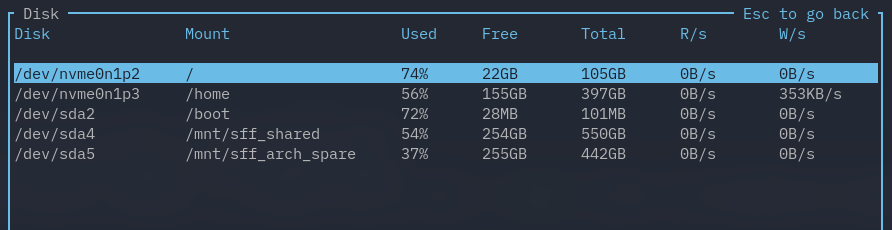
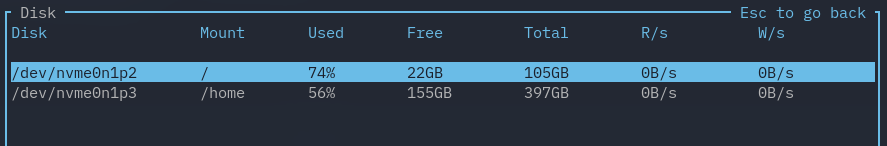
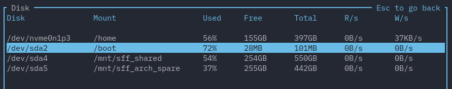

# Data Filtering

!!! Warning

    This section is in progress, and is just copied from the old documentation.

You can hide specific disks, temperature sensors, and networks by name in the config file via `disk.name_filter` and `disk.mount_filter`, `temperature.sensor_filter`, and `network.interface_filter` respectively. Regex (`regex = true`), case-sensitivity (`case_sensitive = true`), and matching only if the entire word matches (`whole_word = true`) are supported, but are off by default. Filters default to denying entries that match and can be toggled by setting `is_list_ignored` to `false` in the config file.

For example, here's the disk widget with no filter:



The following in the config file would filter out some entries by disk name:

```toml
[disk.name_filter]
is_list_ignored = true
list = ["/dev/sda"]
regex = true
case_sensitive = false
whole_word = false
```



If there are two potentially conflicting filters (i.e. when you are using both a disk and mount filter), the filter that explicitly allows an entry takes precedence over a filter that explicitly denies one. So for example, let's say we set a disk filter accepting anything with `/dev/sda`, but deny anything with `/mnt/.*` or `/`. So to do so, we write in the config file:

```toml
[disk.name_filter]
is_list_ignored = false
list = ["/dev/sda"]
regex = true
case_sensitive = false
whole_word = false

[disk.mount_filter]
is_list_ignored = true
list = ["/mnt/.*", "/"]
regex = true
case_sensitive = false
whole_word = true
```

This gives us:


