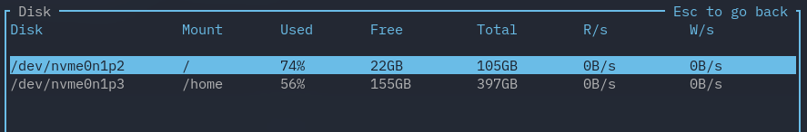
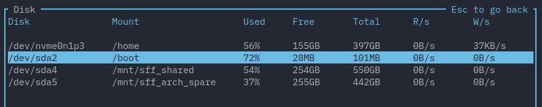

# Disk Table

## Columns

You can configure which columns are shown by the disk table widget by setting the `columns` setting:

```toml
[disk]
# Pick which columns you want to use in any order.
columns = ["Disk", "Mount", "Used", "Free", "Total", "Used%", "R/s", "W/s"]
```

## Filtering Entries

You can filter out what entries to show by configuring `[disk.name_filter]` and `[disk.mount_filter]` to filter by name and mount point respectively. In particular,
you can set a list of things to filter with by setting `list`, and configure how that list
is processed with the other options.

For example, consider a disk widget showing these entries:


If we wanted to ignoring any entry with a name that matches `/dev/sda`:

```toml
[disk.name_filter]
# Whether to ignore any matches. Defaults to true.
is_list_ignored = true

# A list of filters to try and match.
list = ["/dev/sda"]

# Whether to use regex. Defaults to false.
regex = true

# Whether to be case-sensitive. Defaults to false.
case_sensitive = false

# Whether to be require matching the whole word. Defaults to false.
whole_word = false
```

This would give us:



We can also combine both the name filter and mount filter. For example:

```toml
[disk.name_filter]
is_list_ignored = false
list = ["/dev/sda"]
regex = true
case_sensitive = false
whole_word = false

[disk.mount_filter]
is_list_ignored = true
list = ["/mnt/.*", "/"]
regex = true
case_sensitive = false
whole_word = true
```

This gives us:


