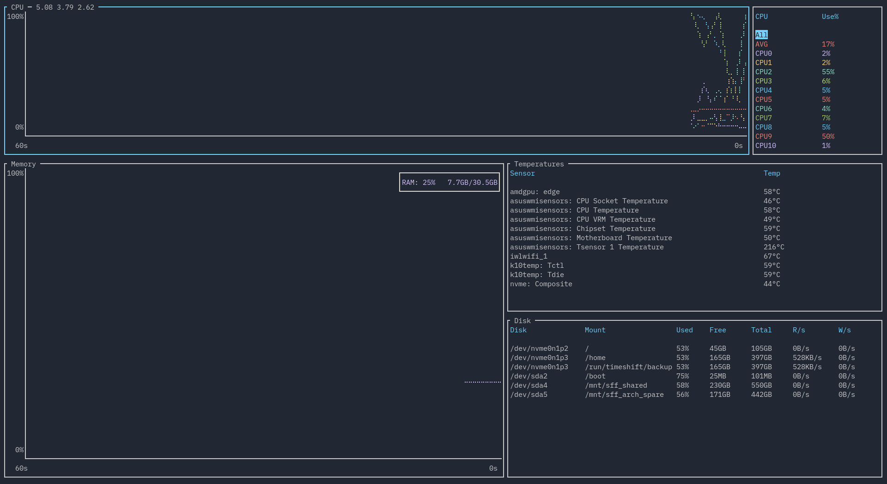

# Layout

!!! Warning

    This section is in progress, and is just copied from the old documentation.

bottom supports customizable layouts via the config file. Currently, layouts are controlled by using TOML objects and arrays.

For example, given the sample layout:

```toml
[[row]]
  [[row.child]]
  type="cpu"
[[row]]
    ratio=2
    [[row.child]]
      ratio=4
      type="mem"
    [[row.child]]
      ratio=3
      [[row.child.child]]
        type="temp"
      [[row.child.child]]
        type="disk"
```

This would give a layout that has two rows, with a 1:2 ratio. The first row has only the CPU widget.
The second row is split into two columns with a 4:3 ratio. The first column contains the memory widget.
The second column is split into two rows with a 1:1 ratio. The first is the temperature widget, the second is the disk widget.

This is what the layout would look like when run:



Each `[[row]]` represents a _row_ in the layout. A row can have any number of `child` values. Each `[[row.child]]`
represents either a _column or a widget_. A column can have any number of `child` values as well. Each `[[row.child.child]]`
represents a _widget_. A widget is represented by having a `type` field set to a string.

The following `type` values are supported:

|                                  |                          |
| -------------------------------- | ------------------------ |
| `"cpu"`                          | CPU chart and legend     |
| `"mem", "memory"`                | Memory chart             |
| `"net", "network"`               | Network chart and legend |
| `"proc", "process", "processes"` | Process table and search |
| `"temp", "temperature"`          | Temperature table        |
| `"disk"`                         | Disk table               |
| `"empty"`                        | An empty space           |
| `"batt", "battery"`              | Battery statistics       |

Each component of the layout accepts a `ratio` value. If this is not set, it defaults to 1.

Furthermore, you can have duplicate widgets.

For an example, look at the [default config](https://github.com/ClementTsang/bottom/blob/main/sample_configs/default_config.toml), which contains the default layout.
