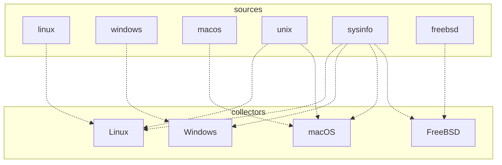

# Data Collection

**Note:** This information is really only useful to _developers_ of bottom,
and can be ignored by users.

Data collection in bottom has two main components: **sources** and **collectors**.

**Sources** are either libraries or system APIs that actually extract the data.
These may map to multiple different operating systems. Examples are `sysinfo`,
or `libc` bindings, or Linux-specific code.

**Collectors** are _platform-specific_ (typically OS-specific), and can pull from
different sources to get all the data needed, with some glue code in between. As
such, sources should be written to be per-"job", and be divided such that
collectors can import specific code as needed.

We can kinda visualize this with a quick-and-dirty diagram (note this is not accurate or up-to-date):

## Sources

As mentioned above, sources should be written in a way where collectors can easily pick the necessary code required.

## Collectors

Each platform should implement the `DataCollector` trait in `collectors/common.rs`. The trait has default implementations where essentially no work is done, which is used as fallback behaviour.
